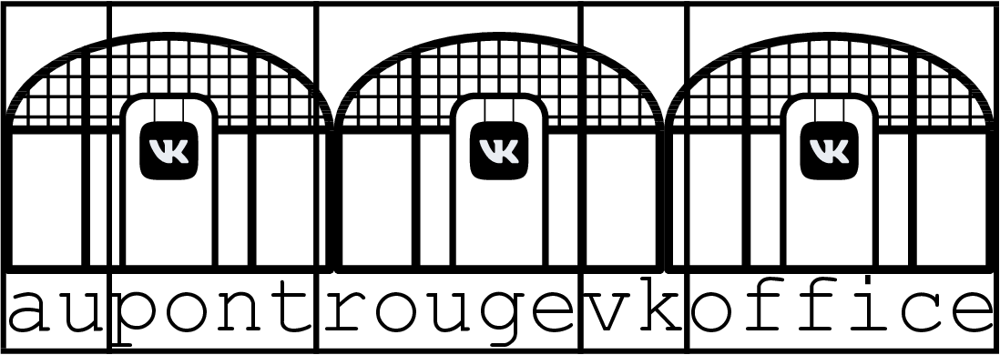

<h1 style='text-align: center;'> C. Au Pont Rouge</h1>

<h5 style='text-align: center;'>time limit per test: 2 seconds</h5>
<h5 style='text-align: center;'>memory limit per test: 512 megabytes</h5>

VK just opened its second HQ in St. Petersburg! Side of its office building has a huge string $s$ written on its side. This part of the office is supposed to be split into $m$ meeting rooms in such way that meeting room walls are strictly between letters on the building. Obviously, meeting rooms should not be of size 0, but can be as small as one letter wide. Each meeting room will be named after the substring of $s$ written on its side.

For each possible arrangement of $m$ meeting rooms we ordered a test meeting room label for the meeting room with lexicographically minimal name. When delivered, those labels got sorted backward lexicographically.

What is printed on $k$th label of the delivery?

## Input

In the first line, you are given three integer numbers $n, m, k$ — length of string $s$, number of planned meeting rooms to split $s$ into and number of the interesting label ($2 \le n \le 1\,000; 1 \le m \le 1\,000; 1 \le k \le 10^{18}$).

Second input line has string $s$, consisting of $n$ lowercase english letters.

For given $n, m, k$ there are at least $k$ ways to split $s$ into $m$ substrings.

## Output

## Output

 single string – name of meeting room printed on $k$-th label of the delivery.

## Examples

## Input


```

4 2 1
abac

```
## Output


```

aba

```
## Input


```

19 5 1821
aupontrougevkoffice

```
## Output


```

au

```
## Note

In the first example, delivery consists of the labels "aba", "ab", "a".

In the second example, delivery consists of $3060$ labels. The first label is "aupontrougevkof" and the last one is "a".


#### tags 

#2800 #binary_search #dp #strings 