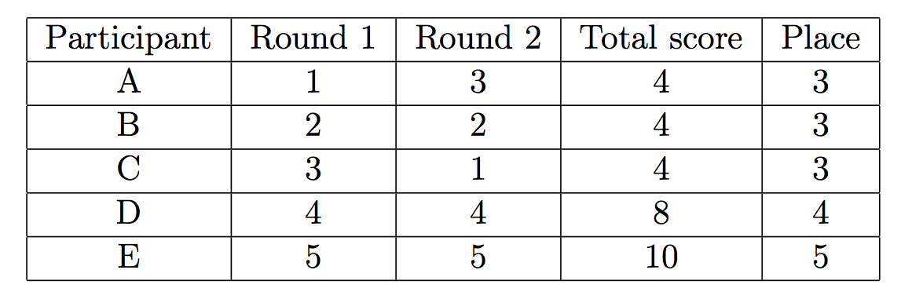

<h1 style='text-align: center;'> B. Different Rules</h1>

<h5 style='text-align: center;'>time limit per test: 1 second</h5>
<h5 style='text-align: center;'>memory limit per test: 256 megabytes</h5>

Nikolay has only recently started in competitive programming, but already qualified to the finals of one prestigious olympiad. There going to be $n$ participants, one of whom is Nikolay. Like any good olympiad, it consists of two rounds. Tired of the traditional rules, in which the participant who solved the largest number of problems wins, the organizers came up with different rules.

Suppose in the first round participant A took $x$-th place and in the second round — $y$-th place. Then the total score of the participant A is sum $x + y$. The overall place of the participant A is the number of participants (including A) having their total score less than or equal to the total score of A. ## Note

, that some participants may end up having a common overall place. It is also important to note, that in both the first and the second round there were no two participants tying at a common place. In other words, for every $i$ from $1$ to $n$ exactly one participant took $i$-th place in first round and exactly one participant took $i$-th place in second round.

Right after the end of the Olympiad, Nikolay was informed that he got $x$-th place in first round and $y$-th place in the second round. Nikolay doesn't know the results of other participants, yet he wonders what is the minimum and maximum place he can take, if we consider the most favorable and unfavorable outcome for him. Please help Nikolay to find the answer to this question.

## Input

The first line contains an integer $t$ ($1 \le t \le 100$) — the number of test cases to solve.

Each of the following $t$ lines contains integers $n$, $x$, $y$ ($1 \leq n \leq 10^9$, $1 \le x, y \le n$) — the number of participants in the olympiad, the place that Nikolay took in the first round and the place that Nikolay took in the second round.

## Output

Print two integers — the minimum and maximum possible overall place Nikolay could take.

## Examples

## Input


```
1  
5 1 3  

```
## Output


```
1 3  

```
## Input


```
1  
6 3 4  

```
## Output


```
2 6  

```
## Note

Explanation for the first example:

Suppose there were 5 participants A-E. Let's denote Nikolay as A. The the most favorable results for Nikolay could look as follows:

  However, the results of the Olympiad could also look like this:

  In the first case Nikolay would have taken first place, and in the second — third place.


#### tags 

#1700 #constructive_algorithms #greedy #implementation #math 