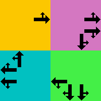

<h1 style='text-align: center;'> B. Piet</h1>

<h5 style='text-align: center;'>time limit per test: 2 seconds</h5>
<h5 style='text-align: center;'>memory limit per test: 256 megabytes</h5>

Piet is one of the most known visual esoteric programming languages. The programs in Piet are constructed from colorful blocks of pixels and interpreted using pretty complicated rules. In this problem we will use a subset of Piet language with simplified rules.

The program will be a rectangular image consisting of colored and black pixels. The color of each pixel will be given by an integer number between 0 and 9, inclusive, with 0 denoting black. A block of pixels is defined as a rectangle of pixels of the same color (not black). It is guaranteed that all connected groups of colored pixels of the same color will form rectangular blocks. Groups of black pixels can form arbitrary shapes.

The program is interpreted using movement of instruction pointer (IP) which consists of three parts:

* current block pointer (BP); note that there is no concept of current pixel within the block;
* direction pointer (DP) which can point left, right, up or down;
* block chooser (CP) which can point to the left or to the right from the direction given by DP; in absolute values CP can differ from DP by 90 degrees counterclockwise or clockwise, respectively.

Initially BP points to the block which contains the top-left corner of the program, DP points to the right, and CP points to the left (see the orange square on the image below).

One step of program interpretation changes the state of IP in a following way. The interpreter finds the furthest edge of the current color block in the direction of the DP. From all pixels that form this edge, the interpreter selects the furthest one in the direction of CP. After this, BP attempts to move from this pixel into the next one in the direction of DP. If the next pixel belongs to a colored block, this block becomes the current one, and two other parts of IP stay the same. It the next pixel is black or outside of the program, BP stays the same but two other parts of IP change. If CP was pointing to the left, now it points to the right, and DP stays the same. If CP was pointing to the right, now it points to the left, and DP is rotated 90 degrees clockwise.

This way BP will never point to a black block (it is guaranteed that top-left pixel of the program will not be black).

You are given a Piet program. You have to figure out which block of the program will be current after *n* steps.

## Input

The first line of the input contains two integer numbers *m* (1 ≤ *m* ≤ 50) and *n* (1 ≤ *n* ≤ 5·107). Next *m* lines contain the rows of the program. All the lines have the same length between 1 and 50 pixels, and consist of characters 0-9. The first character of the first line will not be equal to 0.

## Output

## Output

 the color of the block which will be current after *n* steps of program interpretation.

## Examples

## Input


```
2 10  
12  
43  

```
## Output


```
1  

```
## Input


```
3 12  
1423  
6624  
6625  

```
## Output


```
6  

```
## Input


```
5 9  
10345  
23456  
34567  
45678  
56789  

```
## Output


```
5  

```
## Note

In the first example IP changes in the following way. After step 1 block 2 becomes current one and stays it after two more steps. After step 4 BP moves to block 3, after step 7 — to block 4, and finally after step 10 BP returns to block 1.

  The sequence of states of IP is shown on the image: the arrows are traversed clockwise, the main arrow shows direction of DP, the side one — the direction of CP.


#### tags 

#2100 #implementation 