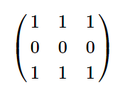
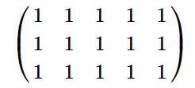

<h1 style='text-align: center;'> B. Count Subrectangles</h1>

<h5 style='text-align: center;'>time limit per test: 1 second</h5>
<h5 style='text-align: center;'>memory limit per test: 512 megabytes</h5>

You are given an array $a$ of length $n$ and array $b$ of length $m$ both consisting of only integers $0$ and $1$. Consider a matrix $c$ of size $n \times m$ formed by following rule: $c_{i, j} = a_i \cdot b_j$ (i.e. $a_i$ multiplied by $b_j$). It's easy to see that $c$ consists of only zeroes and ones too.

How many subrectangles of size (area) $k$ consisting only of ones are there in $c$?

A subrectangle is an intersection of a consecutive (subsequent) segment of rows and a consecutive (subsequent) segment of columns. I.e. consider four integers $x_1, x_2, y_1, y_2$ ($1 \le x_1 \le x_2 \le n$, $1 \le y_1 \le y_2 \le m$) a subrectangle $c[x_1 \dots x_2][y_1 \dots y_2]$ is an intersection of the rows $x_1, x_1+1, x_1+2, \dots, x_2$ and the columns $y_1, y_1+1, y_1+2, \dots, y_2$.

The size (area) of a subrectangle is the total number of cells in it.

## Input

The first line contains three integers $n$, $m$ and $k$ ($1 \leq n, m \leq 40\,000, 1 \leq k \leq n \cdot m$), length of array $a$, length of array $b$ and required size of subrectangles.

The second line contains $n$ integers $a_1, a_2, \ldots, a_n$ ($0 \leq a_i \leq 1$), elements of $a$.

The third line contains $m$ integers $b_1, b_2, \ldots, b_m$ ($0 \leq b_i \leq 1$), elements of $b$.

## Output

## Output

 single integer — the number of subrectangles of $c$ with size (area) $k$ consisting only of ones.

## Examples

## Input


```

3 3 2
1 0 1
1 1 1

```
## Output


```

4

```
## Input


```

3 5 4
1 1 1
1 1 1 1 1

```
## Output


```

14

```
## Note

In first example matrix $c$ is:

  There are $4$ subrectangles of size $2$ consisting of only ones in it:

  In second example matrix $c$ is:

  

#### tags 

#1500 #binary_search #greedy #implementation 