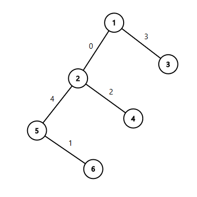

<h1 style='text-align: center;'> C. Ehab and Path-etic MEXs</h1>

<h5 style='text-align: center;'>time limit per test: 1 second</h5>
<h5 style='text-align: center;'>memory limit per test: 256 megabytes</h5>

You are given a tree consisting of $n$ nodes. You want to write some labels on the tree's edges such that the following conditions hold:

* Every label is an integer between $0$ and $n-2$ inclusive.
* All the written labels are distinct.
* The largest value among $MEX(u,v)$ over all pairs of nodes $(u,v)$ is as small as possible.

Here, $MEX(u,v)$ denotes the smallest non-negative integer that isn't written on any edge on the unique simple path from node $u$ to node $v$.

## Input

The first line contains the integer $n$ ($2 \le n \le 10^5$) — the number of nodes in the tree.

Each of the next $n-1$ lines contains two space-separated integers $u$ and $v$ ($1 \le u,v \le n$) that mean there's an edge between nodes $u$ and $v$. It's guaranteed that the given graph is a tree.

## Output

## Output

 $n-1$ integers. The $i^{th}$ of them will be the number written on the $i^{th}$ edge (in the input order).

## Examples

## Input


```

3
1 2
1 3

```
## Output


```

0
1

```
## Input


```

6
1 2
1 3
2 4
2 5
5 6

```
## Output


```

0
3
2
4
1
```
## Note

The tree from the second sample:




#### tags 

#1500 #constructive_algorithms #dfs_and_similar #greedy #trees 