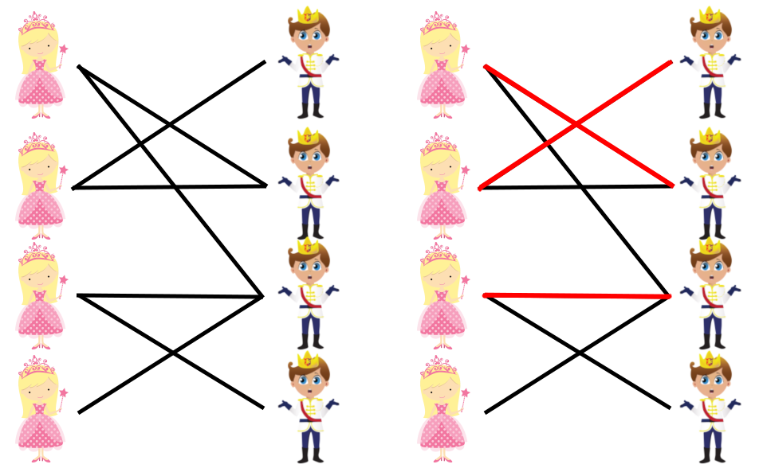

<h1 style='text-align: center;'> B. Princesses and Princes</h1>

<h5 style='text-align: center;'>time limit per test: 2 seconds</h5>
<h5 style='text-align: center;'>memory limit per test: 256 megabytes</h5>

The King of Berland Polycarp LXXXIV has $n$ daughters. To establish his power to the neighbouring kingdoms he wants to marry his daughters to the princes of these kingdoms. As a lucky coincidence there are $n$ other kingdoms as well.

So Polycarp LXXXIV has enumerated his daughters from $1$ to $n$ and the kingdoms from $1$ to $n$. For each daughter he has compiled a list of kingdoms princes of which she wanted to marry.

Polycarp LXXXIV is very busy, so he finds a couple for his daughters greedily one after another.

For the first daughter he takes the kingdom with the lowest number from her list and marries the daughter to their prince. For the second daughter he takes the kingdom with the lowest number from her list, prince of which hasn't been taken already. If there are no free princes in the list then the daughter marries nobody and Polycarp LXXXIV proceeds to the next daughter. The process ends after the $n$-th daughter.

For example, let there be $4$ daughters and kingdoms, the lists daughters have are $[2, 3]$, $[1, 2]$, $[3, 4]$, $[3]$, respectively.

  In that case daughter $1$ marries the prince of kingdom $2$, daughter $2$ marries the prince of kingdom $1$, daughter $3$ marries the prince of kingdom $3$, leaving daughter $4$ nobody to marry to.

Actually, before starting the marriage process Polycarp LXXXIV has the time to convince one of his daughters that some prince is also worth marrying to. Effectively, that means that he can add exactly one kingdom to exactly one of his daughter's list. ## Note

 that this kingdom should not be present in the daughter's list.

Polycarp LXXXIV wants to increase the number of married couples.

Unfortunately, what he doesn't have the time for is determining what entry to add. If there is no way to increase the total number of married couples then output that the marriages are already optimal. Otherwise, find such an entry that the total number of married couples increases if Polycarp LXXXIV adds it.

If there are multiple ways to add an entry so that the total number of married couples increases then print any of them.

For your and our convenience you are asked to answer $t$ independent test cases.

## Input

The first line contains a single integer $t$ ($1 \le t \le 10^5$) — the number of test cases.

Then $t$ test cases follow.

The first line of each test case contains a single integer $n$ ($1 \le n \le 10^5$) — the number of daughters and the number of kingdoms.

Each of the next $n$ lines contains the description of each daughter's list. The first integer $k$ ($0 \le k \le n$) is the number of entries in the $i$-th daughter's list. After that $k$ distinct integers follow $g_i[1], g_i[2], \dots, g_i[k]$ ($1 \le g_i[j] \le n$) — the indices of the kingdoms in the list in the increasing order ($g_i[1] < g_i[2] < \dots < g_i[k]$).

It's guaranteed that the total number of daughters over all test cases does not exceed $10^5$.

It's also guaranteed that the total number of kingdoms in lists over all test cases does not exceed $10^5$.

## Output

For each test case print the answer to it.

Print "IMPROVE" in the first line if Polycarp LXXXIV can add some kingdom to some of his daughter's list so that the total number of married couples increases. The second line then should contain two integers — the index of the daughter and the index of the kingdom Polycarp LXXXIV should add to that daughter's list.

If there are multiple ways to add an entry so that the total number of married couples increases then print any of them.

Otherwise the only line should contain one word "OPTIMAL".

## Example

## Input


```

5
4
2 2 3
2 1 2
2 3 4
1 3
2
0
0
3
3 1 2 3
3 1 2 3
3 1 2 3
1
1 1
4
1 1
1 2
1 3
1 4

```
## Output


```

IMPROVE
4 4
IMPROVE
1 1
OPTIMAL
OPTIMAL
OPTIMAL

```
## Note

The first test case is depicted in the statement. Adding the fourth kingdom to the list of the fourth daughter makes her marry the prince of the fourth kingdom.

In the second test case any new entry will increase the number of marriages from $0$ to $1$.

In the third and the fourth test cases there is no way to add an entry.

In the fifth test case there is no way to change the marriages by adding any entry.


#### tags 

#1200 #brute_force #graphs #greedy 