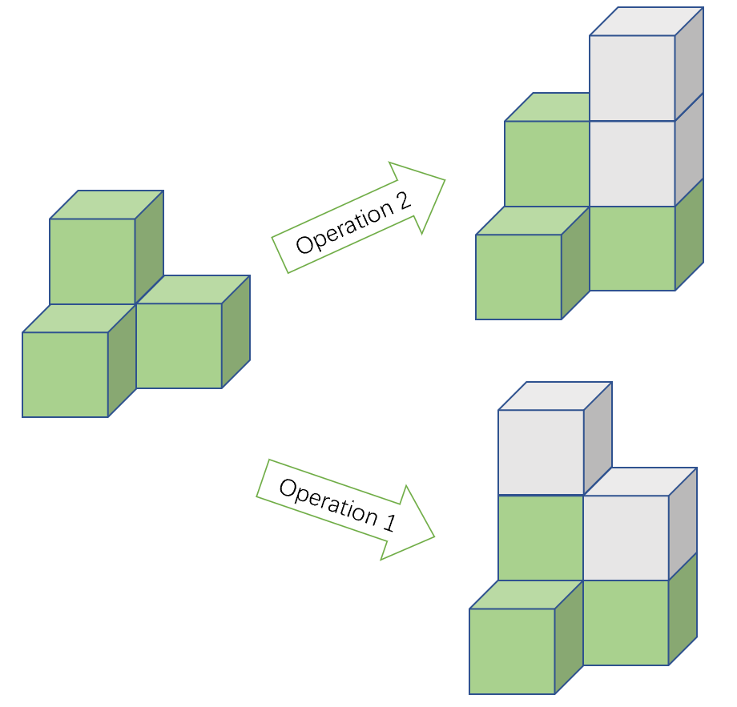

<h1 style='text-align: center;'> E. Height All the Same</h1>

<h5 style='text-align: center;'>time limit per test: 2 seconds</h5>
<h5 style='text-align: center;'>memory limit per test: 512 megabytes</h5>

Alice has got addicted to a game called Sirtet recently.

In Sirtet, player is given an $n \times m$ grid. Initially $a_{i,j}$ cubes are stacked up in the cell $(i,j)$. Two cells are called adjacent if they share a side. Player can perform the following operations: 

* stack up one cube in two adjacent cells;
* stack up two cubes in one cell.

Cubes mentioned above are identical in height.

Here is an illustration of the game. States on the right are obtained by performing one of the above operations on the state on the left, and grey cubes are added due to the operation.

  Player's goal is to make the height of all cells the same (i.e. so that each cell has the same number of cubes in it) using above operations. 

Alice, however, has found out that on some starting grids she may never reach the goal no matter what strategy she uses. Thus, she is wondering the number of initial grids such that 

* $L \le a_{i,j} \le R$ for all $1 \le i \le n$, $1 \le j \le m$;
* player can reach the goal using above operations.

Please help Alice with it. Notice that the answer might be large, please output the desired value modulo $998,244,353$.

## Input

The only line contains four integers $n$, $m$, $L$ and $R$ ($1\le n,m,L,R \le 10^9$, $L \le R$, $n \cdot m \ge 2$).

## Output

## Output

 one integer, representing the desired answer modulo $998,244,353$.

## Examples

## Input


```

2 2 1 1

```
## Output


```

1

```
## Input


```

1 2 1 2

```
## Output


```

2

```
## Note

In the first sample, the only initial grid that satisfies the requirements is $a_{1,1}=a_{2,1}=a_{1,2}=a_{2,2}=1$. Thus the answer should be $1$.

In the second sample, initial grids that satisfy the requirements are $a_{1,1}=a_{1,2}=1$ and $a_{1,1}=a_{1,2}=2$. Thus the answer should be $2$.


#### tags 

#2100 #combinatorics #constructive_algorithms #math #matrices 