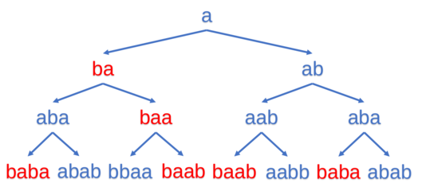

<h1 style='text-align: center;'> C. Kaavi and Magic Spell</h1>

<h5 style='text-align: center;'>time limit per test: 2 seconds</h5>
<h5 style='text-align: center;'>memory limit per test: 512 megabytes</h5>

Kaavi, the mysterious fortune teller, deeply believes that one's fate is inevitable and unavoidable. Of course, she makes her living by predicting others' future. While doing divination, Kaavi believes that magic spells can provide great power for her to see the future. 

 Kaavi has a string $T$ of length $m$ and all the strings with the prefix $T$ are magic spells. Kaavi also has a string $S$ of length $n$ and an empty string $A$.

During the divination, Kaavi needs to perform a sequence of operations. There are two different operations:

* Delete the first character of $S$ and add it at the front of $A$.
* Delete the first character of $S$ and add it at the back of $A$.

Kaavi can perform no more than $n$ operations. To finish the divination, she wants to know the number of different operation sequences to make $A$ a magic spell (i.e. with the prefix $T$). As her assistant, can you help her? The answer might be huge, so Kaavi only needs to know the answer modulo $998\,244\,353$.

Two operation sequences are considered different if they are different in length or there exists an $i$ that their $i$-th operation is different. 

A substring is a contiguous sequence of characters within a string. A prefix of a string $S$ is a substring of $S$ that occurs at the beginning of $S$.

## Input

The first line contains a string $S$ of length $n$ ($1 \leq n \leq 3000$).

The second line contains a string $T$ of length $m$ ($1 \leq m \leq n$).

Both strings contain only lowercase Latin letters.

## Output

The output contains only one integer  — the answer modulo $998\,244\,353$.

## Examples

## Input


```

abab
ba

```
## Output


```

12
```
## Input


```

defineintlonglong
signedmain

```
## Output


```

0
```
## Input


```

rotator
rotator

```
## Output


```

4
```
## Input


```

cacdcdbbbb
bdcaccdbbb

```
## Output


```

24
```
## Note

The first test:



The red ones are the magic spells. In the first operation, Kaavi can either add the first character "a" at the front or the back of $A$, although the results are the same, they are considered as different operations. So the answer is $6\times2=12$.


#### tags 

#2200 #dp #strings 