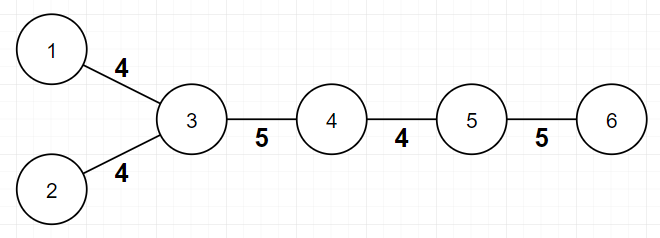
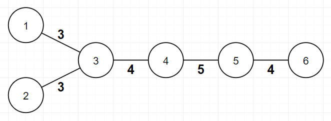
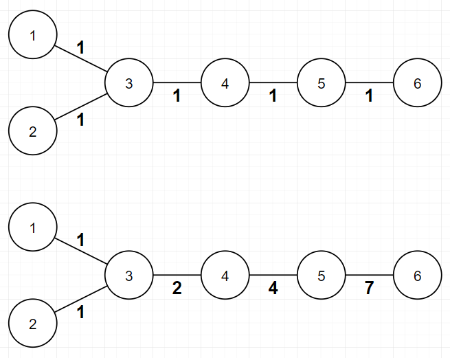
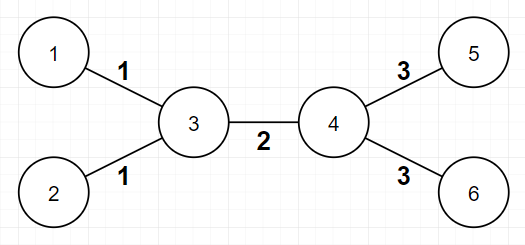
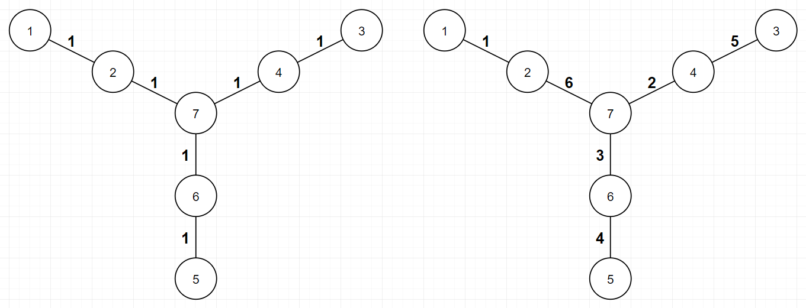

<h1 style='text-align: center;'> B. Edge Weight Assignment</h1>

<h5 style='text-align: center;'>time limit per test: 1 second</h5>
<h5 style='text-align: center;'>memory limit per test: 256 megabytes</h5>

You have unweighted tree of $n$ vertices. You have to assign a positive weight to each edge so that the following condition would hold:

* For every two different leaves $v_{1}$ and $v_{2}$ of this tree, [bitwise XOR](https://en.wikipedia.org/wiki/Bitwise_operation#XOR) of weights of all edges on the simple path between $v_{1}$ and $v_{2}$ has to be equal to $0$.

## Note

 that you can put very large positive integers (like $10^{(10^{10})}$).

It's guaranteed that such assignment always exists under given constraints. Now let's define $f$ as the number of distinct weights in assignment.

  In this example, assignment is valid, because bitwise XOR of all edge weights between every pair of leaves is $0$. $f$ value is $2$ here, because there are $2$ distinct edge weights($4$ and $5$). In this example, assignment is invalid, because bitwise XOR of all edge weights between vertex $1$ and vertex $6$ ($3, 4, 5, 4$) is not $0$. 

What are the minimum and the maximum possible values of $f$ for the given tree? Find and print both.

## Input

The first line contains integer $n$ ($3 \le n \le 10^{5}$) — the number of vertices in given tree.

The $i$-th of the next $n-1$ lines contains two integers $a_{i}$ and $b_{i}$ ($1 \le a_{i} \lt b_{i} \le n$) — it means there is an edge between $a_{i}$ and $b_{i}$. It is guaranteed that given graph forms tree of $n$ vertices.

## Output

Print two integers — the minimum and maximum possible value of $f$ can be made from valid assignment of given tree. ## Note

 that it's always possible to make an assignment under given constraints.

## Examples

## Input


```

6
1 3
2 3
3 4
4 5
5 6

```
## Output


```

1 4

```
## Input


```

6
1 3
2 3
3 4
4 5
4 6

```
## Output


```

3 3

```
## Input


```

7
1 2
2 7
3 4
4 7
5 6
6 7

```
## Output


```

1 6

```
## Note

In the first example, possible assignments for each minimum and maximum are described in picture below. Of course, there are multiple possible assignments for each minimum and maximum. 

  In the second example, possible assignments for each minimum and maximum are described in picture below. The $f$ value of valid assignment of this tree is always $3$. 

  In the third example, possible assignments for each minimum and maximum are described in picture below. Of course, there are multiple possible assignments for each minimum and maximum. 

  

#### tags 

#1800 #bitmasks #constructive_algorithms #dfs_and_similar #greedy #math #trees 