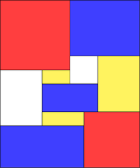

<h1 style='text-align: center;'> F. Piet's Palette</h1>

<h5 style='text-align: center;'>time limit per test: 2 seconds</h5>
<h5 style='text-align: center;'>memory limit per test: 256 megabytes</h5>

Piet Mondrian is an artist most famous for his minimalist works, consisting only of the four colors red, yellow, blue, and white. Most people attribute this to his style, but the truth is that his paint behaves in a very strange way where mixing two primary colors only produces another primary color!

  A lesser known piece, entitled "Pretentious rectangles" A sequence of primary colors (red, yellow, blue) is mixed as follows. While there are at least two colors, look at the first two. If they are distinct, replace them with the missing color. If they are the same, remove them from the sequence. In the end, if there is one color, that is the resulting color. Otherwise, if the sequence is empty, we say the resulting color is white. Here are two example mixings:

       Piet has a color palette with cells numbered from $1$ to $n$. Each cell contains a primary color or is empty. Piet is very secretive, and will not share his palette with you, so you do not know what colors belong to each cell.

However, he did perform $k$ operations. There are four kinds of operations: 

1. In a mix operation, Piet chooses a subset of cells and mixes their colors together in some order. The order is not necessarily by increasing indexes. He records the resulting color. Empty cells are skipped over, having no effect on the mixing process. The mixing does not change the color values stored in the cells.
2. In a RY operation, Piet chooses a subset of cells. Any red cells in this subset become yellow, and any yellow cells in this subset become red. Blue and empty cells remain unchanged.
3. In a RB operation, Piet chooses a subset of cells. Any red cells in this subset become blue, and any blue cells in this subset become red. Yellow and empty cells remain unchanged.
4. In a YB operation, Piet chooses a subset of cells. Any yellow cells in this subset become blue, and any blue cells in this subset become yellow. Red and empty cells remain unchanged.

Piet only tells you the list of operations he performs in chronological order, the indexes involved, and the resulting color of each mix operation. For each mix operation, you also know the order in which the cells are mixed. Given this information, determine the color of each cell in the initial palette. That is, you should find one possible state of the palette (before any operations were performed), or say that the described situation is impossible.

## Input

The first line contains two integers $n$ and $k$ ($1\le n,k\le 1000$) — the number of cells in the palette and the number of operations, respectively.

The next $k$ lines describe the operations. The $i$-th line begins with the name of the $i$-th operation and an integer $m$ ($1\le m\le n$) — the number of indexes involved. Then follow $m$ integers $j_1,\ldots,j_m$ ($1\le j_i\le n$) — the indexes of the operation. It is guaranteed that all $j_i$ are distinct within an operation. If it is a mix operation, the indexes are listed in the order the colors are mixed, and the line also ends with a character representing the resulting color: "R" for red, "Y" for yellow, "B" for blue, and "W" for white.

## Output

## Output

 "YES" if a solution exists, or "NO" otherwise. You can print each character in any case (upper or lower).

If the answer is "YES", on the next line output a string of length $n$, consisting of characters "R", "Y", "B", and ".", representing the paint colors in the $n$ cells of the initial palette (red, yellow, blue, and empty, respectively). If there are multiple solutions, print any. You can print each character in any case (upper or lower).

## Examples

## Input


```

3 2
mix 2 2 1 R
mix 2 1 3 Y

```
## Output


```

YES
YB.

```
## Input


```

2 3
mix 1 2 Y
RB 1 2
mix 1 2 W

```
## Output


```

NO

```
## Input


```

1 3
RY 1 1
YB 1 1
mix 1 1 B

```
## Output


```

YES
R

```
## Input


```

3 8
mix 2 1 2 R
mix 2 1 3 Y
RY 2 2 3
RB 3 1 2 3
YB 3 1 2 3
mix 1 1 W
mix 1 2 B
mix 1 3 Y

```
## Output


```

YES
.RY

```
## Note

For the first test case, the answer "YB." is consistent with both mixings. The first mixing "BY" results in red, while the second mixing "Y" results in yellow (the empty cell is ignored). Other valid solutions include "BYR" and ".RY".

For the second test case, we can show that no solution exists.

For the third test case, the answer "R" is consistent with all operations. In the first two operations it changes to "Y", then "B". In the final operation, the mixing "B" results in blue.

For the fourth test case, the answer ".RY" is consistent with all operations. The first two mixings are "R" and "Y", resulting in red and yellow, respectively. During the next three operations, the palette changes to ".YR", then ".YB", then ".BY". The final three mixings agree with this palette.


#### tags 

#3200 #matrices 