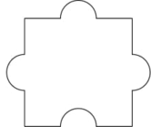
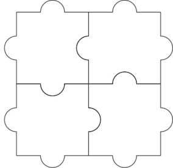

<h1 style='text-align: center;'> A. Puzzle Pieces</h1>

<h5 style='text-align: center;'>time limit per test: 1 second</h5>
<h5 style='text-align: center;'>memory limit per test: 256 megabytes</h5>

You are given a special jigsaw puzzle consisting of $n\cdot m$ identical pieces. Every piece has three tabs and one blank, as pictured below.

  The jigsaw puzzle is considered solved if the following conditions hold:

1. The pieces are arranged into a grid with $n$ rows and $m$ columns.
2. For any two pieces that share an edge in the grid, a tab of one piece fits perfectly into a blank of the other piece.

Through rotation and translation of the pieces, determine if it is possible to solve the jigsaw puzzle.

## Input

The test consists of multiple test cases. The first line contains a single integer $t$ ($1\le t\le 1000$) — the number of test cases. Next $t$ lines contain descriptions of test cases.

Each test case contains two integers $n$ and $m$ ($1 \le n,m \le 10^5$).

## Output

For each test case output a single line containing "YES" if it is possible to solve the jigsaw puzzle, or "NO" otherwise. You can print each letter in any case (upper or lower).

## Example

## Input


```

3
1 3
100000 100000
2 2

```
## Output


```

YES
NO
YES

```
## Note

For the first test case, this is an example solution: 

  For the second test case, we can show that no solution exists.

For the third test case, this is an example solution:

  

#### tags 

#800 #math 