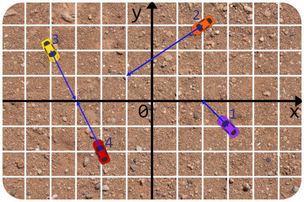
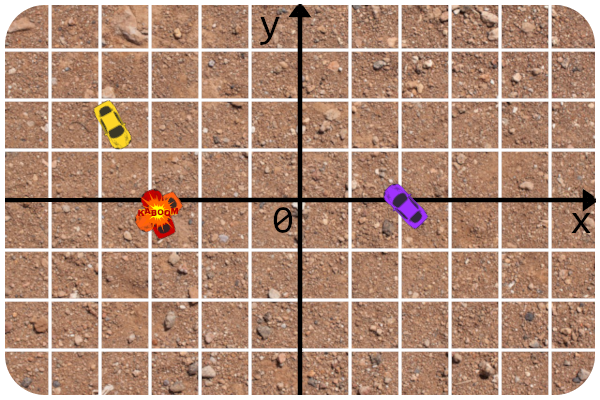
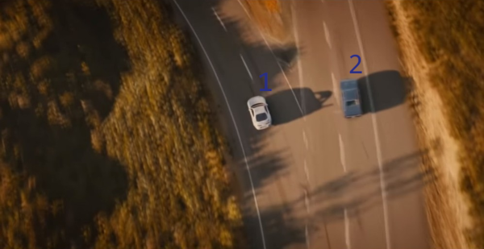

<h1 style='text-align: center;'> F. RC Kaboom Show</h1>

<h5 style='text-align: center;'>time limit per test: 6 seconds</h5>
<h5 style='text-align: center;'>memory limit per test: 256 megabytes</h5>

You know, it's hard to conduct a show with lots of participants and spectators at the same place nowadays. Still, you are not giving up on your dream to make a car crash showcase! You decided to replace the real cars with remote controlled ones, call the event "Remote Control Kaboom Show" and stream everything online.

For the preparation you arranged an arena — an infinite 2D-field. You also bought $n$ remote controlled cars and set them up on the arena. Unfortunately, the cars you bought can only go forward without turning left, right or around. So you additionally put the cars in the direction you want them to go.

To be formal, for each car $i$ ($1 \le i \le n$) you chose its initial position ($x_i, y_i$) and a direction vector ($dx_i, dy_i$). Moreover, each car has a constant speed $s_i$ units per second. So after car $i$ is launched, it stars moving from ($x_i, y_i$) in the direction ($dx_i, dy_i$) with constant speed $s_i$.

The goal of the show is to create a car collision as fast as possible! You noted that launching every car at the beginning of the show often fails to produce any collisions at all. Thus, you plan to launch the $i$-th car at some moment $t_i$. You haven't chosen $t_i$, that's yet to be decided. ## Note

 that it's not necessary for $t_i$ to be integer and $t_i$ is allowed to be equal to $t_j$ for any $i, j$.

The show starts at time $0$. The show ends when two cars $i$ and $j$ ($i \ne j$) collide (i. e. come to the same coordinate at the same time). The duration of the show is the time between the start and the end.

What's the fastest crash you can arrange by choosing all $t_i$? If it's possible to arrange a crash then print the shortest possible duration of the show. Otherwise, report that it's impossible.

## Input

The first line contains a single integer $n$ ($1 \le n \le 25000$) — the number of cars.

Each of the next $n$ lines contains five integers $x_i$, $y_i$, $dx_i$, $dy_i$, $s_i$ ($-10^3 \le x_i, y_i \le 10^3$; $1 \le |dx_i| \le 10^3$; $1 \le |dy_i| \le 10^3$; $1 \le s_i \le 10^3$) — the initial position of the $i$-th car, its direction vector and its speed, respectively.

It's guaranteed that all cars start at distinct positions (i. e. $(x_i, y_i) \neq (x_j, y_j)$ for $i \neq j$).

## Output

Print the shortest possible duration of the show if it's possible to arrange a crash by choosing all $t_i$. Otherwise, print "No show :(".

Your answer is considered correct if its absolute or relative error does not exceed $10^{-6}$.

Formally, let your answer be $a$, and the jury's answer be $b$. Your answer is accepted if and only if $\frac{|a - b|}{\max{(1, |b|)}} \le 10^{-6}$.

## Examples

## Input


```

4
3 -1 -1 1 2
2 3 -3 -2 10
-4 2 1 -2 1
-2 -2 -1 2 4

```
## Output


```

0.585902082262898

```
## Input


```

2
-1 1 -1 1 200
1 1 1 5 200

```
## Output


```

No show :(

```
## Note

Here is the picture for the first example: 

  The fastest cars to crash are cars $2$ and $4$. Let's launch car $2$ at $0$, car $4$ at about $0.096762$ and cars $1$ and $3$ at arbitrary time. That way cars $2$ and $4$ will crash into each other at about $0.585902$. So here's what it looks like at the moment of the collision:

  Here's the picture for the second example:

  

#### tags 

#2900 #binary_search #brute_force #data_structures #geometry #math 