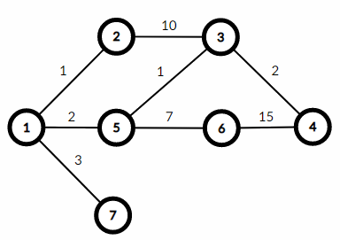

<h1 style='text-align: center;'> F. Jog Around The Graph</h1>

<h5 style='text-align: center;'>time limit per test: 2 seconds</h5>
<h5 style='text-align: center;'>memory limit per test: 256 megabytes</h5>

You are given a simple weighted connected undirected graph, consisting of $n$ vertices and $m$ edges.

A path in the graph of length $k$ is a sequence of $k+1$ vertices $v_1, v_2, \dots, v_{k+1}$ such that for each $i$ $(1 \le i \le k)$ the edge $(v_i, v_{i+1})$ is present in the graph. A path from some vertex $v$ also has vertex $v_1=v$. ## Note

 that edges and vertices are allowed to be included in the path multiple times.

The weight of the path is the total weight of edges in it.

For each $i$ from $1$ to $q$ consider a path from vertex $1$ of length $i$ of the maximum weight. What is the sum of weights of these $q$ paths?

Answer can be quite large, so print it modulo $10^9+7$.

## Input

The first line contains a three integers $n$, $m$, $q$ ($2 \le n \le 2000$; $n - 1 \le m \le 2000$; $m \le q \le 10^9$) — the number of vertices in the graph, the number of edges in the graph and the number of lengths that should be included in the answer.

Each of the next $m$ lines contains a description of an edge: three integers $v$, $u$, $w$ ($1 \le v, u \le n$; $1 \le w \le 10^6$) — two vertices $v$ and $u$ are connected by an undirected edge with weight $w$. The graph contains no loops and no multiple edges. It is guaranteed that the given edges form a connected graph.

## Output

Print a single integer — the sum of the weights of the paths from vertex $1$ of maximum weights of lengths $1, 2, \dots, q$ modulo $10^9+7$.

## Examples

## Input


```

7 8 25
1 2 1
2 3 10
3 4 2
1 5 2
5 6 7
6 4 15
5 3 1
1 7 3

```
## Output


```

4361

```
## Input


```

2 1 5
1 2 4

```
## Output


```

60

```
## Input


```

15 15 23
13 10 12
11 14 12
2 15 5
4 10 8
10 2 4
10 7 5
3 10 1
5 6 11
1 13 8
9 15 4
4 2 9
11 15 1
11 12 14
10 8 12
3 6 11

```
## Output


```

3250

```
## Input


```

5 10 10000000
2 4 798
1 5 824
5 2 558
4 1 288
3 4 1890
3 1 134
2 3 1485
4 5 284
3 5 1025
1 2 649

```
## Output


```

768500592

```
## Note

Here is the graph for the first example:

  Some maximum weight paths are: 

* length $1$: edges $(1, 7)$ — weight $3$;
* length $2$: edges $(1, 2), (2, 3)$ — weight $1+10=11$;
* length $3$: edges $(1, 5), (5, 6), (6, 4)$ — weight $2+7+15=24$;
* length $4$: edges $(1, 5), (5, 6), (6, 4), (6, 4)$ — weight $2+7+15+15=39$;
* $\dots$

So the answer is the sum of $25$ terms: $3+11+24+39+\dots$

In the second example the maximum weight paths have weights $4$, $8$, $12$, $16$ and $20$.


#### tags 

#2700 #binary_search #dp #geometry #graphs 