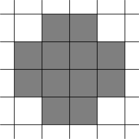

<h1 style='text-align: center;'> C. Even Picture</h1>

<h5 style='text-align: center;'>time limit per test: 2 seconds</h5>
<h5 style='text-align: center;'>memory limit per test: 512 megabytes</h5>

Leo Jr. draws pictures in his notebook with checkered sheets (that is, each sheet has a regular square grid printed on it). We can assume that the sheets are infinitely large in any direction.

To draw a picture, Leo Jr. colors some of the cells on a sheet gray. He considers the resulting picture beautiful if the following conditions are satisfied:

* The picture is connected, that is, it is possible to get from any gray cell to any other by following a chain of gray cells, with each pair of adjacent cells in the path being neighbours (that is, sharing a side).
* Each gray cell has an even number of gray neighbours.
* There are exactly $n$ gray cells with all gray neighbours. The number of other gray cells can be arbitrary (but reasonable, so that they can all be listed).

Leo Jr. is now struggling to draw a beautiful picture with a particular choice of $n$. Help him, and provide any example of a beautiful picture.

To output cell coordinates in your answer, assume that the sheet is provided with a Cartesian coordinate system such that one of the cells is chosen to be the origin $(0, 0)$, axes $0x$ and $0y$ are orthogonal and parallel to grid lines, and a unit step along any axis in any direction takes you to a neighbouring cell.

## Input

The only line contains a single integer $n$ ($1 \leq n \leq 500$) — the number of gray cells with all gray neighbours in a beautiful picture.

## Output

In the first line, print a single integer $k$ — the number of gray cells in your picture. For technical reasons, $k$ should not exceed $5 \cdot 10^5$.

Each of the following $k$ lines should contain two integers — coordinates of a gray cell in your picture. All listed cells should be distinct, and the picture should satisdfy all the properties listed above. All coordinates should not exceed $10^9$ by absolute value.

One can show that there exists an answer satisfying all requirements with a small enough $k$.

## Example

## Input


```

4

```
## Output


```

12
1 0
2 0
0 1
1 1
2 1
3 1
0 2
1 2
2 2
3 2
1 3
2 3

```
## Note

The answer for the sample is pictured below:

  

#### tags 

#1500 #constructive_algorithms 