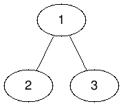

<h1 style='text-align: center;'> F1. The Hidden Pair (Easy Version)</h1>

<h5 style='text-align: center;'>time limit per test: 2 seconds</h5>
<h5 style='text-align: center;'>memory limit per test: 256 megabytes</h5>

## Note

 that the only difference between the easy and hard version is the constraint on the number of queries. You can make hacks only if all versions of the problem are solved.

This is an interactive problem.

You are given a tree consisting of $n$ nodes numbered with integers from $1$ to $n$. Ayush and Ashish chose two secret distinct nodes in the tree. You need to find out both the nodes. You can make the following query: 

* Provide a list of nodes and you will receive a node from that list whose sum of distances to both the hidden nodes is minimal (if there are multiple such nodes in the list, you will receive any one of them). You will also get the sum of distances of that node to the hidden nodes.

Recall that a tree is a connected graph without cycles. The distance between two nodes is defined as the number of edges in the simple path between them.

More formally, let's define two hidden nodes as $s$ and $f$. In one query you can provide the set of nodes $\{a_1, a_2, \ldots, a_c\}$ of the tree. As a result, you will get two numbers $a_i$ and $dist(a_i, s) + dist(a_i, f)$. The node $a_i$ is any node from the provided set, for which the number $dist(a_i, s) + dist(a_i, f)$ is minimal.

You can ask no more than $14$ queries.

## Input

The first line contains a single integer $t$ $(1 \leq t \leq 10)$ — the number of test cases. Please note, how the interaction process is organized.

The first line of each test case consists of a single integer $n$ $(2 \le n \le 1000)$ — the number of nodes in the tree.

The next $n - 1$ lines consist of two integers $u$, $v$ $(1 \le u, v \le n, u \ne v)$ — the edges of the tree.

## Interaction

To ask a query print a single line: 

* In the beginning print "? c " (without quotes) where $c$ $(1 \leq c \leq n)$ denotes the number of nodes being queried, followed by $c$ distinct integers in the range $[1, n]$  — the indices of nodes from the list.

For each query, you will receive two integers $x$, $d$ — the node (among the queried nodes) with the minimum sum of distances to the hidden nodes and the sum of distances from that node to the hidden nodes. If the subset of nodes queried is invalid or you exceeded the number of queries then you will get $x = d = -1$. In this case, you should terminate the program immediately.

When you have guessed the hidden nodes, print a single line "! " (without quotes), followed by two integers in the range $[1, n]$  — the hidden nodes. You can output the hidden nodes in any order.

After this, you should read a string. If you guess the nodes correctly, you will receive the string "Correct". In this case, you should continue solving the remaining test cases or terminate the program, if all test cases were solved. Otherwise, you will receive the string "Incorrect". In this case, you should terminate the program immediately.

Guessing the hidden nodes does not count towards the number of queries asked.

The interactor is not adaptive. The hidden nodes do not change with queries.

Do not forget to read the string "Correct" / "Incorrect" after guessing the hidden nodes.

You need to solve each test case before receiving the input for the next test case.

The limit of $14$ queries applies to each test case and not to the entire input.

After printing a query do not forget to output the end of the line and flush the output. Otherwise, you will get Idleness limit exceeded. To do this, use:

* fflush(stdout) or cout.flush() in C++;
* System.out.flush() in Java;
* flush(output) in Pascal;
* stdout.flush() in Python;
* see the documentation for other languages.

Hacks

To hack the solution, use the following test format:

The first line should contain a single integer $t$ $(1 \leq t \leq 10)$ — the number of test cases. The description of the test cases follows.

The first line of each test case should contain a single integer $n$ $(2 \le n \le 1000)$ — the number of nodes in the tree. The second line should contain two distinct integers in the range $[1, n]$  — the hidden nodes. The next $n - 1$ lines should contain two integers $u$, $v$ $(1 \le u, v \le n, u \ne v)$  — the edges of the tree.

## Example

## Input


```

1
3
1 2
1 3

1 1

2 3

3 1

3 1

Correct
```
Output
```

? 1 1

? 1 2

? 1 3

? 2 2 3

! 1 3
```
## Note

The tree from the first test is shown below, and the hidden nodes are $1$ and $3$.



#### tags 

#2400 #binary_search #dfs_and_similar #graphs #interactive #shortest_paths #trees 