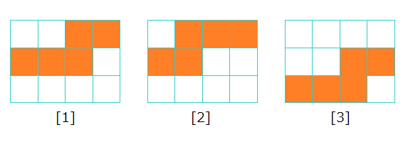
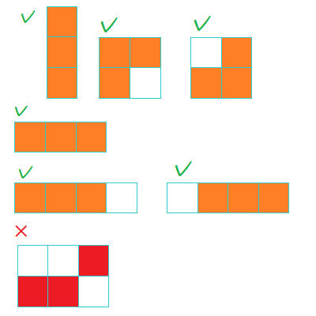

<h1 style='text-align: center;'> B. Magical Calendar</h1>

<h5 style='text-align: center;'>time limit per test: 1 second</h5>
<h5 style='text-align: center;'>memory limit per test: 256 megabytes</h5>

A competitive eater, Alice is scheduling some practices for an eating contest on a magical calendar. The calendar is unusual because a week contains not necessarily $7$ days!

In detail, she can choose any integer $k$ which satisfies $1 \leq k \leq r$, and set $k$ days as the number of days in a week.

Alice is going to paint some $n$ consecutive days on this calendar. On this calendar, dates are written from the left cell to the right cell in a week. If a date reaches the last day of a week, the next day's cell is the leftmost cell in the next (under) row.

She wants to make all of the painted cells to be connected by side. It means, that for any two painted cells there should exist at least one sequence of painted cells, started in one of these cells, and ended in another, such that any two consecutive cells in this sequence are connected by side.

Alice is considering the shape of the painted cells. Two shapes are the same if there exists a way to make them exactly overlapped using only parallel moves, parallel to the calendar's sides.

For example, in the picture, a week has $4$ days and Alice paints $5$ consecutive days. [1] and [2] are different shapes, but [1] and [3] are equal shapes.

  Alice wants to know how many possible shapes exists if she set how many days a week has and choose consecutive $n$ days and paints them in calendar started in one of the days of the week. As was said before, she considers only shapes, there all cells are connected by side.

## Input

The input consists of multiple test cases. The first line contains a single integer $t$ ($1 \le t \le 1000$) — the number of test cases. Next $t$ lines contain descriptions of test cases.

For each test case, the only line contains two integers $n$, $r$ ($1 \le n \le 10^9, 1 \le r \le 10^9$).

## Output

For each test case, print a single integer  — the answer to the problem.

Please note, that the answer for some test cases won't fit into $32$-bit integer type, so you should use at least $64$-bit integer type in your programming language.

## Example

## Input


```

5
3 4
3 2
3 1
13 7
1010000 9999999

```
## Output


```

4
3
1
28
510049495001

```
## Note

In the first test case, Alice can set $1,2,3$ or $4$ days as the number of days in a week.

There are $6$ possible paintings shown in the picture, but there are only $4$ different shapes. So, the answer is $4$. Notice that the last example in the picture is an invalid painting because all cells are not connected by sides.

  In the last test case, be careful with the overflow issue, described in the output format.


#### tags 

#1200 #math 