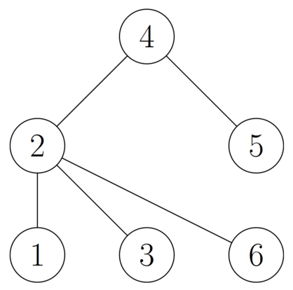
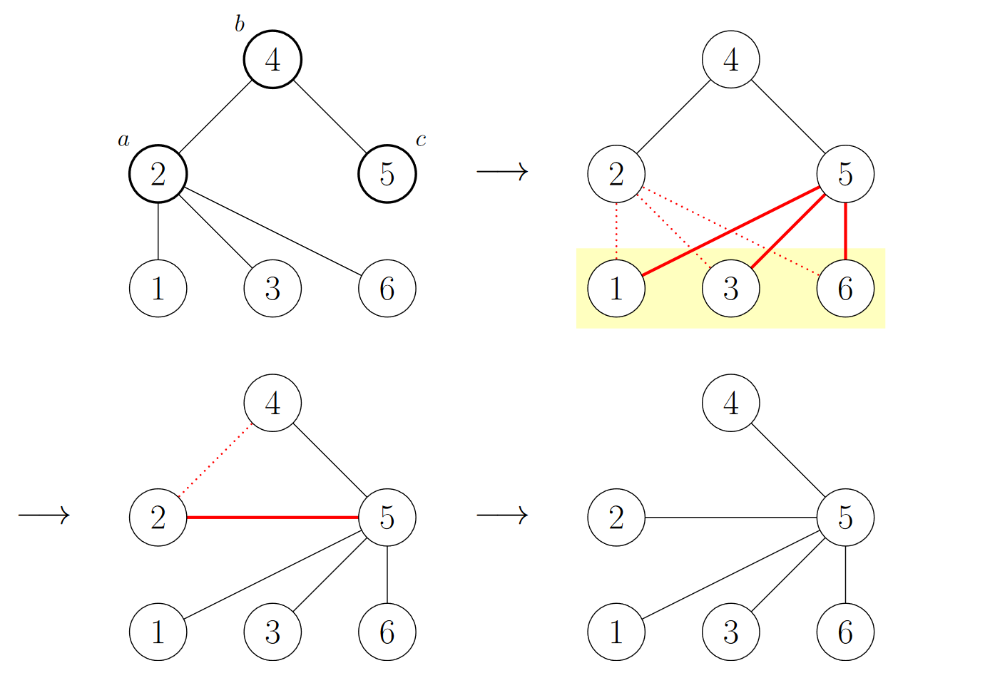

<h1 style='text-align: center;'> G. Tree Modification</h1>

<h5 style='text-align: center;'>time limit per test: 1 second</h5>
<h5 style='text-align: center;'>memory limit per test: 256 megabytes</h5>

You are given a tree with $n$ vertices. You are allowed to modify the structure of the tree through the following multi-step operation:

1. Choose three vertices $a$, $b$, and $c$ such that $b$ is adjacent to both $a$ and $c$.
2. For every vertex $d$ other than $b$ that is adjacent to $a$, remove the edge connecting $d$ and $a$ and add the edge connecting $d$ and $c$.
3. Delete the edge connecting $a$ and $b$ and add the edge connecting $a$ and $c$.

As an example, consider the following tree:

  The following diagram illustrates the sequence of steps that happen when we apply an operation to vertices $2$, $4$, and $5$:

  It can be proven that after each operation, the resulting graph is still a tree.

Find the minimum number of operations that must be performed to transform the tree into a star. A star is a tree with one vertex of degree $n - 1$, called its center, and $n - 1$ vertices of degree $1$.

## Input

The first line contains an integer $n$ ($3 \le n \le 2 \cdot 10^5$)  — the number of vertices in the tree.

The $i$-th of the following $n - 1$ lines contains two integers $u_i$ and $v_i$ ($1 \le u_i, v_i \le n$, $u_i \neq v_i$) denoting that there exists an edge connecting vertices $u_i$ and $v_i$. It is guaranteed that the given edges form a tree.

## Output

Print a single integer  — the minimum number of operations needed to transform the tree into a star.

It can be proven that under the given constraints, it is always possible to transform the tree into a star using at most $10^{18}$ operations.

## Examples

## Input


```

6
4 5
2 6
3 2
1 2
2 4

```
## Output


```

1

```
## Input


```

4
2 4
4 1
3 4

```
## Output


```

0

```
## Note

The first test case corresponds to the tree shown in the statement. As we have seen before, we can transform the tree into a star with center at vertex $5$ by applying a single operation to vertices $2$, $4$, and $5$.

In the second test case, the given tree is already a star with the center at vertex $4$, so no operations have to be performed.


#### tags 

#2800 #brute_force #constructive_algorithms #dfs_and_similar #graph_matchings #graphs #trees 