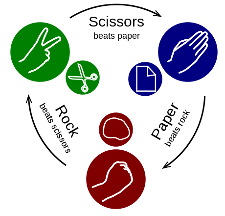

<h1 style='text-align: center;'> B. Universal Solution</h1>

<h5 style='text-align: center;'>time limit per test: 2 seconds</h5>
<h5 style='text-align: center;'>memory limit per test: 256 megabytes</h5>

Recently, you found a bot to play "Rock paper scissors" with. Unfortunately, the bot uses quite a simple algorithm to play: he has a string $s = s_1 s_2 \dots s_{n}$ of length $n$ where each letter is either R, S or P.

While initializing, the bot is choosing a starting index $pos$ ($1 \le pos \le n$), and then it can play any number of rounds. In the first round, he chooses "Rock", "Scissors" or "Paper" based on the value of $s_{pos}$: 

* if $s_{pos}$ is equal to R the bot chooses "Rock";
* if $s_{pos}$ is equal to S the bot chooses "Scissors";
* if $s_{pos}$ is equal to P the bot chooses "Paper";

In the second round, the bot's choice is based on the value of $s_{pos + 1}$. In the third round — on $s_{pos + 2}$ and so on. After $s_n$ the bot returns to $s_1$ and continues his game.

You plan to play $n$ rounds and you've already figured out the string $s$ but still don't know what is the starting index $pos$. But since the bot's tactic is so boring, you've decided to find $n$ choices to each round to maximize the average number of wins.

In other words, let's suggest your choices are $c_1 c_2 \dots c_n$ and if the bot starts from index $pos$ then you'll win in $win(pos)$ rounds. Find $c_1 c_2 \dots c_n$ such that $\frac{win(1) + win(2) + \dots + win(n)}{n}$ is maximum possible.

## Input

The first line contains a single integer $t$ ($1 \le t \le 1000$) — the number of test cases.

Next $t$ lines contain test cases — one per line. The first and only line of each test case contains string $s = s_1 s_2 \dots s_{n}$ ($1 \le n \le 2 \cdot 10^5$; $s_i \in \{\text{R}, \text{S}, \text{P}\}$) — the string of the bot.

It's guaranteed that the total length of all strings in one test doesn't exceed $2 \cdot 10^5$.

## Output

For each test case, print $n$ choices $c_1 c_2 \dots c_n$ to maximize the average number of wins. Print them in the same manner as the string $s$.

If there are multiple optimal answers, print any of them.

## Example

## Input


```

3
RRRR
RSP
S

```
## Output


```

PPPP
RSP
R
```
## Note

In the first test case, the bot (wherever it starts) will always choose "Rock", so we can always choose "Paper". So, in any case, we will win all $n = 4$ rounds, so the average is also equal to $4$.

In the second test case: 

* if bot will start from $pos = 1$, then $(s_1, c_1)$ is draw, $(s_2, c_2)$ is draw and $(s_3, c_3)$ is draw, so $win(1) = 0$;
* if bot will start from $pos = 2$, then $(s_2, c_1)$ is win, $(s_3, c_2)$ is win and $(s_1, c_3)$ is win, so $win(2) = 3$;
* if bot will start from $pos = 3$, then $(s_3, c_1)$ is lose, $(s_1, c_2)$ is lose and $(s_2, c_3)$ is lose, so $win(3) = 0$;

 The average is equal to $\frac{0 + 3 + 0}{3} = 1$ and it can be proven that it's the maximum possible average.A picture from Wikipedia explaining "Rock paper scissors" game: 

  

#### tags 

#1400 #greedy 