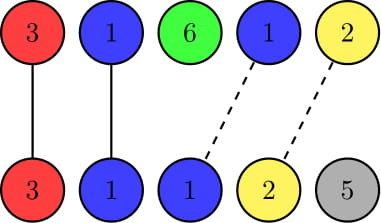

<h1 style='text-align: center;'> C. Mastermind</h1>

<h5 style='text-align: center;'>time limit per test: 1 second</h5>
<h5 style='text-align: center;'>memory limit per test: 256 megabytes</h5>

In the game of Mastermind, there are two players  — Alice and Bob. Alice has a secret code, which Bob tries to guess. Here, a code is defined as a sequence of $n$ colors. There are exactly $n+1$ colors in the entire universe, numbered from $1$ to $n+1$ inclusive.

When Bob guesses a code, Alice tells him some information about how good of a guess it is, in the form of two integers $x$ and $y$.

The first integer $x$ is the number of indices where Bob's guess correctly matches Alice's code. The second integer $y$ is the size of the intersection of the two codes as multisets. That is, if Bob were to change the order of the colors in his guess, $y$ is the maximum number of indices he could get correct.

For example, suppose $n=5$, Alice's code is $[3,1,6,1,2]$, and Bob's guess is $[3,1,1,2,5]$. At indices $1$ and $2$ colors are equal, while in the other indices they are not equal. So $x=2$. And the two codes have the four colors $1,1,2,3$ in common, so $y=4$.

  Solid lines denote a matched color for the same index. Dashed lines denote a matched color at a different index. $x$ is the number of solid lines, and $y$ is the total number of lines. You are given Bob's guess and two values $x$ and $y$. Can you find one possibility of Alice's code so that the values of $x$ and $y$ are correct?

## Input

The first line contains a single integer $t$ ($1\le t\le 1000$)  — the number of test cases. Next $2t$ lines contain descriptions of test cases.

The first line of each test case contains three integers $n,x,y$ ($1\le n\le 10^5, 0\le x\le y\le n$)  — the length of the codes, and two values Alice responds with.

The second line of each test case contains $n$ integers $b_1,\ldots,b_n$ ($1\le b_i\le n+1$)  — Bob's guess, where $b_i$ is the $i$-th color of the guess.

It is guaranteed that the sum of $n$ across all test cases does not exceed $10^5$.

## Output

For each test case, on the first line, output "YES" if there is a solution, or "NO" if there is no possible secret code consistent with the described situation. You can print each character in any case (upper or lower).

If the answer is "YES", on the next line output $n$ integers $a_1,\ldots,a_n$ ($1\le a_i\le n+1$)  — Alice's secret code, where $a_i$ is the $i$-th color of the code.

If there are multiple solutions, output any.

## Example

## Input


```

7
5 2 4
3 1 1 2 5
5 3 4
1 1 2 1 2
4 0 4
5 5 3 3
4 1 4
2 3 2 3
6 1 2
3 2 1 1 1 1
6 2 4
3 3 2 1 1 1
6 2 6
1 1 3 2 1 1

```
## Output


```

YES
3 1 6 1 2
YES
3 1 1 1 2
YES
3 3 5 5
NO
YES
4 4 4 4 3 1
YES
3 1 3 1 7 7
YES
2 3 1 1 1 1

```
## Note

The first test case is described in the statement.

In the second test case, $x=3$ because the colors are equal at indices $2,4,5$. And $y=4$ because they share the colors $1,1,1,2$.

In the third test case, $x=0$ because there is no index where the colors are the same. But $y=4$ because they share the colors $3,3,5,5$.

In the fourth test case, it can be proved that no solution exists.


#### tags 

#2500 #constructive_algorithms #graph_matchings #greedy #implementation #sortings #two_pointers 