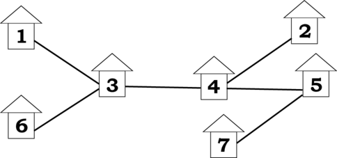

<h1 style='text-align: center;'> B2. Village (Maximum)</h1>

<h5 style='text-align: center;'>time limit per test: 0.75 seconds</h5>
<h5 style='text-align: center;'>memory limit per test: 256 megabytes</h5>

This problem is split into two tasks. In this task, you are required to find the maximum possible answer. In the task Village (Minimum) you are required to find the minimum possible answer. Each task is worth $50$ points.

There are $N$ houses in a certain village. A single villager lives in each of the houses. The houses are connected by roads. Each road connects two houses and is exactly $1$ kilometer long. From each house it is possible to reach any other using one or several consecutive roads. In total there are $N-1$ roads in the village.

One day all villagers decided to move to different houses — that is, after moving each house should again have a single villager living in it, but no villager should be living in the same house as before. We would like to know the largest possible total length in kilometers of the shortest paths between the old and the new houses for all villagers.

 Example village with seven houses 

For example, if there are seven houses connected by roads as shown on the figure, the largest total length is $18$ km (this can be achieved by moving $1 \to 7$, $2 \to 3$, $3 \to 4$, $4 \to 1$, $5 \to 2$, $6 \to 5$, $7 \to 6$).

Write a program that finds the largest total length of the shortest paths in kilometers and an example assignment of the new houses to the villagers.

## Input

The first line contains an integer $N$ ($1 < N \le 10^5$). Houses are numbered by consecutive integers $1, 2, \ldots, N$.

Then $N-1$ lines follow that describe the roads. Each line contains two integers $a$ and $b$ ($1 \le a, b \le N$, $a \neq b$) denoting that there is a road connecting houses $a$ and $b$.

## Output

In the first line output the largest total length of the shortest paths in kilometers.

In the second line describe one valid assignment of the new houses with the largest total length: $N$ space-separated distinct integers $v_1, v_2, \ldots, v_N$. For each $i$, $v_i$ is the house number where villager from the house $i$ should move ($v_i \neq i$). If there are several valid assignments, output any of those.

## Scoring

Subtasks: 

1. (6 points) $N \leq 10$
2. (19 points) $N \leq 1\,000$
3. (25 points) No further constraints
## Examples

## Input


```

4
1 2
2 3
3 4

```
## Output


```

8
4 3 2 1

```
## Input


```

7
4 2
5 7
3 4
6 3
1 3
4 5

```
## Output


```

18
2 7 4 1 3 5 6

```


#### tags 

#2500 #*special #dfs_and_similar #trees 