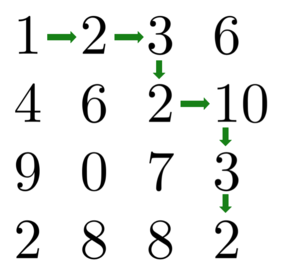
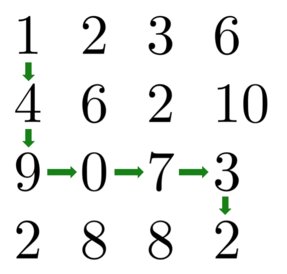
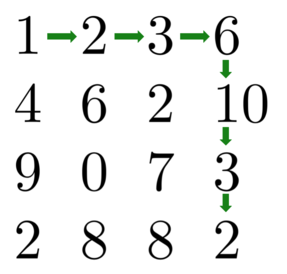

<h1 style='text-align: center;'> E. Omkar and Duck</h1>

<h5 style='text-align: center;'>time limit per test: 2 seconds</h5>
<h5 style='text-align: center;'>memory limit per test: 256 megabytes</h5>

This is an interactive problem.

Omkar has just come across a duck! The duck is walking on a grid with $n$ rows and $n$ columns ($2 \leq n \leq 25$) so that the grid contains a total of $n^2$ cells. Let's denote by $(x, y)$ the cell in the $x$-th row from the top and the $y$-th column from the left. Right now, the duck is at the cell $(1, 1)$ (the cell in the top left corner) and would like to reach the cell $(n, n)$ (the cell in the bottom right corner) by moving either down $1$ cell or to the right $1$ cell each second.

Since Omkar thinks ducks are fun, he wants to play a game with you based on the movement of the duck. First, for each cell $(x, y)$ in the grid, you will tell Omkar a nonnegative integer $a_{x,y}$ not exceeding $10^{16}$, and Omkar will then put $a_{x,y}$ uninteresting problems in the cell $(x, y)$. After that, the duck will start their journey from $(1, 1)$ to $(n, n)$. For each cell $(x, y)$ that the duck crosses during their journey (including the cells $(1, 1)$ and $(n, n)$), the duck will eat the $a_{x,y}$ uninteresting problems in that cell. Once the duck has completed their journey, Omkar will measure their mass to determine the total number $k$ of uninteresting problems that the duck ate on their journey, and then tell you $k$.

Your challenge, given $k$, is to exactly reproduce the duck's path, i. e. to tell Omkar precisely which cells the duck crossed on their journey. To be sure of your mastery of this game, Omkar will have the duck complete $q$ different journeys ($1 \leq q \leq 10^3$). ## Note

 that all journeys are independent: at the beginning of each journey, the cell $(x, y)$ will still contain $a_{x,y}$ uninteresting tasks.

## Interaction

The interaction will begin with a line containing a single integer $n$ ($2 \leq n \leq 25$), the amount of rows and columns in the grid. Read it.

Your program should then print $n$ lines. The $x$-th line should contain $n$ integers $a_{x,1}, a_{x,2}, \dotsc, a_{x,n}$ satisfying $0 \leq a_{x,y} \leq 10^{16}$, where $a_{x,y}$ is the amount of uninteresting problems Omkar should place in the cell $(x, y)$.

After that, you will first receive a single integer $q$, the amount of journeys that the duck will take. $q$ queries will follow; each query will consist of a single line containing an integer $k$, the amount of uninteresting problems that the duck ate on that journey. After each query, given that you have determined that the duck visited the cells $(x_1, y_1), (x_2, y_2), \dotsc, (x_{2n - 1}, y_{2n - 1})$ in that order (it should always be true that $(x_1, y_1) = (1, 1)$ and $(x_{2n - 1}, y_{2n - 1}) = (n, n)$), you should output $2n - 1$ lines so that the $j$-th line contains the two integers $x_j, y_j$.

Bear in mind that if the sum on your path is $k$, but your path is different from the actual hidden path, then your solution is still wrong!

After printing each line do not forget to output end of line and flush the output. Otherwise, you will get Idleness limit exceeded. To do this, use:

* fflush(stdout) or cout.flush() in C++;
* System.out.flush() in Java;
* flush(output) in Pascal;
* stdout.flush() in Python;
* see documentation for other languages.

Hack Format

To hack, first output a line containing $n$ and another line containing $q$. It must be true that $2 \leq n \leq 25$ and $1 \leq q \leq 1000$. Then, output the $q$ journeys taken by the duck in the same format as described above: for each journey, given that the duck visited the cells $(x_1, y_1), (x_2, y_2), \dotsc, (x_{2n - 1}, y_{2n - 1})$ in that order, you should output $2n - 1$ lines so that the $j$-th line contains the two integers $x_j, y_j$. It must be true that $(x_1, y_1) = (1, 1)$ and $(x_{2n - 1}, y_{2n - 1}) = (n, n)$. Additionally, for each $j$ such that $2 \leq j \leq 2n - 1$, it must be true that $1 \leq x_j, y_j \leq n$ and either $(x_j, y_j) = (x_{j - 1} + 1, y_{j - 1})$ or $(x_j, y_j) = (x_{j - 1}, y_{j - 1} + 1)$.

## Example

Input
```

4


3
23


26


27


```
Output
```

1 2 3 6
4 6 2 10
9 0 7 3
2 8 8 2


1 1
1 2
1 3
2 3
2 4
3 4
4 4

1 1
2 1
3 1
3 2
3 3
3 4
4 4

1 1
1 2
1 3
1 4
2 4
3 4
4 4

```
## Note

The duck's three journeys are illustrated below.

$1 + 2 + 3 + 2 + 10 + 3 + 2 = 23$ 

  $1 + 4 + 9 + 0 + 7 + 3 + 2 = 26$ 

  $1 + 2 + 3 + 6 + 10 + 3 + 2 = 27$ 

  

#### tags 

#2100 #bitmasks #constructive_algorithms #interactive #math 