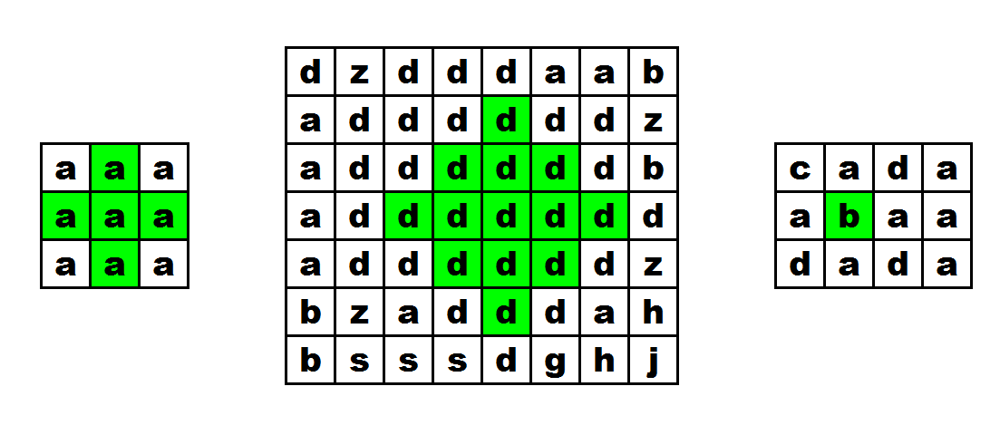
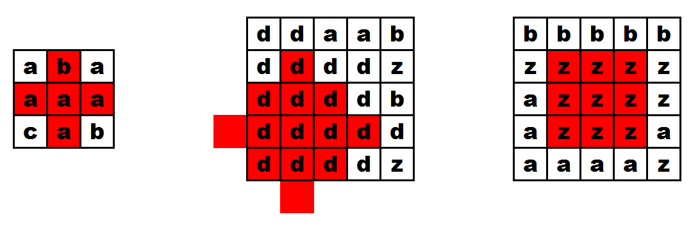

<h1 style='text-align: center;'> D. Rarity and New Dress</h1>

<h5 style='text-align: center;'>time limit per test: 1 second</h5>
<h5 style='text-align: center;'>memory limit per test: 256 megabytes</h5>

Carousel Boutique is busy again! Rarity has decided to visit the pony ball and she surely needs a new dress, because going out in the same dress several times is a sign of bad manners. First of all, she needs a dress pattern, which she is going to cut out from the rectangular piece of the multicolored fabric.

The piece of the multicolored fabric consists of $n \times m$ separate square scraps. Since Rarity likes dresses in style, a dress pattern must only include scraps sharing the same color. A dress pattern must be the square, and since Rarity is fond of rhombuses, the sides of a pattern must form a $45^{\circ}$ angle with sides of a piece of fabric (that way it will be resembling the traditional picture of a rhombus).

## Examples

 of proper dress patterns:  ## Examples

 of improper dress patterns:  The first one consists of multi-colored scraps, the second one goes beyond the bounds of the piece of fabric, the third one is not a square with sides forming a $45^{\circ}$ angle with sides of the piece of fabric.

Rarity wonders how many ways to cut out a dress pattern that satisfies all the conditions that do exist. Please help her and satisfy her curiosity so she can continue working on her new masterpiece!

## Input

The first line contains two integers $n$ and $m$ ($1 \le n, m \le 2000$). Each of the next $n$ lines contains $m$ characters: lowercase English letters, the $j$-th of which corresponds to scrap in the current line and in the $j$-th column. Scraps having the same letter share the same color, scraps having different letters have different colors.

## Output

Print a single integer: the number of ways to cut out a dress pattern to satisfy all of Rarity's conditions.

## Examples

## Input


```

3 3
aaa
aaa
aaa

```
## Output


```

10

```
## Input


```

3 4
abab
baba
abab

```
## Output


```

12

```
## Input


```

5 5
zbacg
baaac
aaaaa
eaaad
weadd

```
## Output


```

31

```
## Note

In the first example, all the dress patterns of size $1$ and one of size $2$ are satisfactory.

In the second example, only the dress patterns of size $1$ are satisfactory.


#### tags 

#2100 #dfs_and_similar #dp #implementation #shortest_paths 