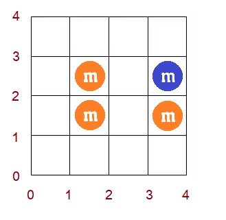

<h1 style='text-align: center;'> D. Rainbow Rectangles</h1>

<h5 style='text-align: center;'>time limit per test: 4 seconds</h5>
<h5 style='text-align: center;'>memory limit per test: 512 megabytes</h5>

Shrimpy Duc is a fat and greedy boy who is always hungry. After a while of searching for food to satisfy his never-ending hunger, Shrimpy Duc finds M&M candies lying unguarded on a $L \times L$ grid. There are $n$ M&M candies on the grid, the $i$-th M&M is currently located at $(x_i + 0.5, y_i + 0.5),$ and has color $c_i$ out of a total of $k$ colors (the size of M&Ms are insignificant).

Shrimpy Duc wants to steal a rectangle of M&Ms, specifically, he wants to select a rectangle with integer coordinates within the grid and steal all candies within the rectangle. Shrimpy Duc doesn't need to steal every single candy, however, he would like to steal at least one candy for each color.

In other words, he wants to select a rectangle whose sides are parallel to the coordinate axes and whose left-bottom vertex $(X_1, Y_1)$ and right-top vertex $(X_2, Y_2)$ are points with integer coordinates satisfying $0 \le X_1 < X_2 \le L$ and $0 \le Y_1 < Y_2 \le L$, so that for every color $1 \le c \le k$ there is at least one M&M with color $c$ that lies within that rectangle.

How many such rectangles are there? This number may be large, so you only need to find it modulo $10^9 + 7$.

## Input

The first line contains three positive integers $n, k, L$ $(1 \leq k \leq n \leq 2 \cdot 10^3, 1 \leq L \leq 10^9 )$ — the number of M&Ms, the number of colors and the length of the grid respectively.

The following $n$ points describe the M&Ms. Each line contains three integers $x_i, y_i, c_i$ $(0 \leq x_i, y_i < L, 1 \le c_i \le k)$ — the coordinates and color of the $i$-th M&M respectively. 

Different M&Ms have different coordinates ($x_i \ne x_j$ or $y_i \ne y_j$ for every $i \ne j$), and for every $1 \le c \le k$ there is at least one M&M with color $c$.

## Output

## Output

 a single integer — the number of rectangles satisfying Shrimpy Duc's conditions, modulo $10^9 + 7$.

## Examples

## Input


```

4 2 4
3 2 2
3 1 1
1 1 1
1 2 1

```
## Output


```

20

```
## Input


```

5 3 10
6 5 3
5 3 1
7 9 1
2 3 2
5 0 2

```
## Output


```

300

```
## Input


```

10 4 10
5 4 4
0 0 3
6 0 1
3 9 2
8 7 1
8 1 3
2 1 3
6 3 2
3 5 3
4 3 4

```
## Output


```

226

```
## Note

Grid for the first sample:




#### tags 

#3300 #data_structures #sortings #two_pointers 