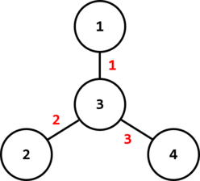

<h1 style='text-align: center;'> D. Maximum Distributed Tree</h1>

<h5 style='text-align: center;'>time limit per test: 2 seconds</h5>
<h5 style='text-align: center;'>memory limit per test: 256 megabytes</h5>

You are given a tree that consists of $n$ nodes. You should label each of its $n-1$ edges with an integer in such way that satisfies the following conditions: 

* each integer must be greater than $0$;
* the product of all $n-1$ numbers should be equal to $k$;
* the number of $1$-s among all $n-1$ integers must be minimum possible.

Let's define $f(u,v)$ as the sum of the numbers on the simple path from node $u$ to node $v$. Also, let $\sum\limits_{i=1}^{n-1} \sum\limits_{j=i+1}^n f(i,j)$ be a distribution index of the tree.

Find the maximum possible distribution index you can get. Since answer can be too large, print it modulo $10^9 + 7$.

In this problem, since the number $k$ can be large, the result of the prime factorization of $k$ is given instead.

## Input

The first line contains one integer $t$ ($1 \le t \le 100$) — the number of test cases.

The first line of each test case contains a single integer $n$ ($2 \le n \le 10^5$) — the number of nodes in the tree.

Each of the next $n-1$ lines describes an edge: the $i$-th line contains two integers $u_i$ and $v_i$ ($1 \le u_i, v_i \le n$; $u_i \ne v_i$) — indices of vertices connected by the $i$-th edge.

Next line contains a single integer $m$ ($1 \le m \le 6 \cdot 10^4$) — the number of prime factors of $k$.

Next line contains $m$ prime numbers $p_1, p_2, \ldots, p_m$ ($2 \le p_i < 6 \cdot 10^4$) such that $k = p_1 \cdot p_2 \cdot \ldots \cdot p_m$.

It is guaranteed that the sum of $n$ over all test cases doesn't exceed $10^5$, the sum of $m$ over all test cases doesn't exceed $6 \cdot 10^4$, and the given edges for each test cases form a tree.

## Output

Print the maximum distribution index you can get. Since answer can be too large, print it modulo $10^9+7$.

## Example

## Input


```

3
4
1 2
2 3
3 4
2
2 2
4
3 4
1 3
3 2
2
3 2
7
6 1
2 3
4 6
7 3
5 1
3 6
4
7 5 13 3

```
## Output


```

17
18
286

```
## Note

 In the first test case, one of the optimal ways is on the following image:

   In this case, $f(1,2)=1$, $f(1,3)=3$, $f(1,4)=5$, $f(2,3)=2$, $f(2,4)=4$, $f(3,4)=2$, so the sum of these $6$ numbers is $17$.

 In the second test case, one of the optimal ways is on the following image:

   In this case, $f(1,2)=3$, $f(1,3)=1$, $f(1,4)=4$, $f(2,3)=2$, $f(2,4)=5$, $f(3,4)=3$, so the sum of these $6$ numbers is $18$.


#### tags 

#1800 #dfs_and_similar #dp #greedy #implementation #math #number_theory #sortings #trees 