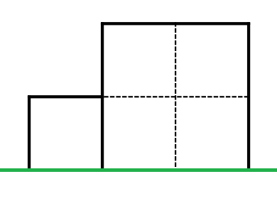
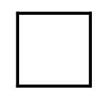
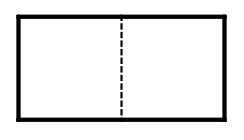
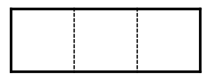
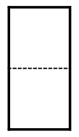
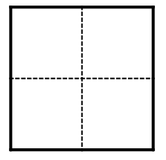

<h1 style='text-align: center;'> A. Fancy Fence</h1>

<h5 style='text-align: center;'>time limit per test: 1 second</h5>
<h5 style='text-align: center;'>memory limit per test: 256 megabytes</h5>

Everybody knows that Balázs has the fanciest fence in the whole town. It's built up from $N$ fancy sections. The sections are rectangles standing closely next to each other on the ground. The $i$th section has integer height $h_i$ and integer width $w_i$. We are looking for fancy rectangles on this fancy fence. A rectangle is fancy if: 

* its sides are either horizontal or vertical and have integer lengths
* the distance between the rectangle and the ground is integer
* the distance between the rectangle and the left side of the first section is integer
* it's lying completely on sections

 What is the number of fancy rectangles? This number can be very big, so we are interested in it modulo $10^9+7$.## Input

The first line contains $N$ ($1\leq N \leq 10^{5}$) – the number of sections. The second line contains $N$ space-separated integers, the $i$th number is $h_i$ ($1 \leq h_i \leq 10^{9}$). The third line contains $N$ space-separated integers, the $i$th number is $w_i$ ($1 \leq w_i \leq 10^{9}$).

## Output

You should print a single integer, the number of fancy rectangles modulo $10^9+7$. So the output range is $0,1,2,\ldots, 10^9+6$.

## Scoring

 $ \begin{array}{|c|c|c|} \hline \text{Subtask} & \text{Points} & \text{Constraints} \\\ \hline 1 & 0 & \text{sample}\\\ \hline 2 & 12 & N \leq 50 \: \text{and} \: h_i \leq 50 \: \text{and} \: w_i = 1 \: \text{for all} \: i \\\ \hline 3 & 13 & h_i = 1 \: \text{or} \: h_i = 2 \: \text{for all} \: i \\\ \hline 4 & 15 & \text{all} \: h_i \: \text{are equal} \\\ \hline 5 & 15 & h_i \leq h_{i+1} \: \text{for all} \: i \leq N-1 \\\ \hline 6 & 18 & N \leq 1000\\\ \hline 7 & 27 & \text{no additional constraints}\\\ \hline \end{array} $## Example

## Input


```

2
1 2
1 2

```
## Output


```

12

```
## Note

The fence looks like this: 

There are 5 fancy rectangles of shape: 

There are 3 fancy rectangles of shape: 

There is 1 fancy rectangle of shape: 

There are 2 fancy rectangles of shape: 

There is 1 fancy rectangle of shape: 


#### tags 

#1800 #*special #data_structures #dsu #implementation #math #sortings 