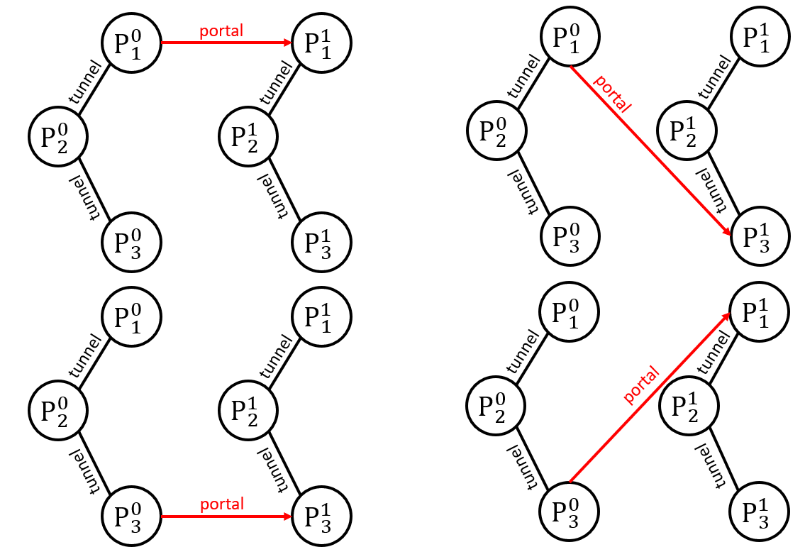

<h1 style='text-align: center;'> C. Star Trek</h1>

<h5 style='text-align: center;'>time limit per test: 1 second</h5>
<h5 style='text-align: center;'>memory limit per test: 256 megabytes</h5>

The United Federation of Planets is an alliance of $N$ planets, they are indexed from $1$ to $N$. Some planets are connected by space tunnels. In a space tunnel, a starship can fly both ways really fast. There are exactly $N-1$ space tunnels, and we can travel from any planet to any other planet in the Federation using these tunnels.

It's well known that there are $D$ additional parallel universes. These are exact copies of our universe, they have the same planets and space tunnels. They are indexed from $1$ to $D$ (our universe has index $0$). We denote the planet $x$ in universe $i$ by $P_x^i$. We can travel from one universe to another using dimension portals. For every $i$ ($0\leq i \leq D-1$), we will place exactly one portal that allows us to fly from $P_{A_i}^i$ to $P_{B_i}^{i+1}$, for some planet indices $A_i$ and $B_i$ (i.e. $1 \leq A_i, B_i \leq N$).

Once all the portals are placed, Starship Batthyány will embark on its maiden voyage. It is currently orbiting around $P_1^0$. Captain Ágnes and Lieutenant Gábor have decided to play the following game: they choose alternately a destination (a planet) to fly to. This planet can be in the same universe, if a space tunnel goes there, or it can be in another universe, if a portal goes there. Their aim is to visit places where no one has gone before. That's why, once they have visited a planet $P_x^i$, they never go back there (but they can visit the planet $x$ in another universe). Captain Ágnes chooses the first destination (then Gábor, then Ágnes etc.). If somebody can't choose a planet where they have not been before in his/her turn, he/she loses.

Captain Ágnes and Lieutenant Gábor are both very clever: they know the locations of all tunnels and portals, and they both play optimally. For how many different placements of portals does Captain Ágnes win the game? Two placements are different if there is an index $i$ ($0\leq i \leq D-1$), where the $i$th portal connects different pairs of planets in the two placements (i.e $A_i$ or $B_i$ differs).

This number can be very big, so we are interested in it modulo $10^9+7$.

## Input

The first line contains two space-separated integers, $N$ ($1\leq N \leq 10^{5}$) – the number of planets and $D$ ($1 \leq D \leq 10^{18}$) – the number of additional parallel universes. Each of the next $N-1$ lines contains two space-separated integers $u$ and $v$ ($1 \leq u, v \leq N$), denoting that $P_u^i$ and $P_v^i$ are connected by a space tunnel for all $i$ ($0 \leq i \leq D$).

## Output

You should print a single integer, the number of possible placements of portals where Captain Ágnes wins modulo $10^9+7$.

## Scoring

 $ \begin{array}{|c|c|c|} \hline \text{Subtask} & \text{Points} & \text{Constraints} \\\ \hline 1 & 0 & \text{samples}\\\ \hline 2 & 7 & N=2 \\\ \hline 3 & 8 & N \leq 100 \: \text{and} \: D = 1 \\\ \hline 4 & 15 & N \leq 1000 \: \text{and} \: D = 1\\\ \hline 5 & 15 & D=1 \\\ \hline 6 & 20 & N \leq 1000 \: \text{and} \: D \leq 10^5\\\ \hline 7 & 20 & D \leq 10^5\\\ \hline 8 & 15 & \text{no additional constraints}\\\ \hline \end{array} $ ## Example

## Input


```

3 1
1 2
2 3

```
## Output


```

4

```
## Note

There is only 1 portal and $3 \cdot 3 = 9$ different placements. The following 4 placements are when the Captain wins.




#### tags 

#2600 #*special #combinatorics #dfs_and_similar #dp #games #graphs #matrices #trees 