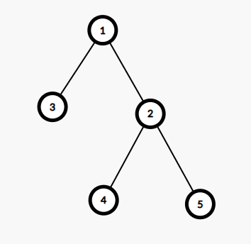
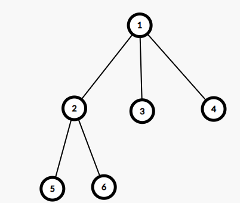

<h1 style='text-align: center;'> C. Link Cut Centroids</h1>

<h5 style='text-align: center;'>time limit per test: 1 second</h5>
<h5 style='text-align: center;'>memory limit per test: 512 megabytes</h5>

Fishing Prince loves trees, and he especially loves trees with only one centroid. The tree is a connected graph without cycles.

A vertex is a centroid of a tree only when you cut this vertex (remove it and remove all edges from this vertex), the size of the largest connected component of the remaining graph is the smallest possible.

For example, the centroid of the following tree is $2$, because when you cut it, the size of the largest connected component of the remaining graph is $2$ and it can't be smaller.

  However, in some trees, there might be more than one centroid, for example:

  Both vertex $1$ and vertex $2$ are centroids because the size of the largest connected component is $3$ after cutting each of them.

Now Fishing Prince has a tree. He should cut one edge of the tree (it means to remove the edge). After that, he should add one edge. The resulting graph after these two operations should be a tree. He can add the edge that he cut.

He wants the centroid of the resulting tree to be unique. Help him and find any possible way to make the operations. It can be proved, that at least one such way always exists.

## Input

The input consists of multiple test cases. The first line contains an integer $t$ ($1\leq t\leq 10^4$) — the number of test cases. The description of the test cases follows.

The first line of each test case contains an integer $n$ ($3\leq n\leq 10^5$) — the number of vertices.

Each of the next $n-1$ lines contains two integers $x, y$ ($1\leq x,y\leq n$). It means, that there exists an edge connecting vertices $x$ and $y$.

It's guaranteed that the given graph is a tree.

It's guaranteed that the sum of $n$ for all test cases does not exceed $10^5$.

## Output

For each test case, print two lines.

In the first line print two integers $x_1, y_1$ ($1 \leq x_1, y_1 \leq n$), which means you cut the edge between vertices $x_1$ and $y_1$. There should exist edge connecting vertices $x_1$ and $y_1$.

In the second line print two integers $x_2, y_2$ ($1 \leq x_2, y_2 \leq n$), which means you add the edge between vertices $x_2$ and $y_2$.

The graph after these two operations should be a tree.

If there are multiple solutions you can print any.

## Example

## Input


```

2
5
1 2
1 3
2 4
2 5
6
1 2
1 3
1 4
2 5
2 6

```
## Output


```

1 2
1 2
1 3
2 3
```
## Note

## Note

 that you can add the same edge that you cut.

In the first test case, after cutting and adding the same edge, the vertex $2$ is still the only centroid.

In the second test case, the vertex $2$ becomes the only centroid after cutting the edge between vertices $1$ and $3$ and adding the edge between vertices $2$ and $3$.


#### tags 

#1700 #constructive_algorithms #dfs_and_similar #graphs #trees 