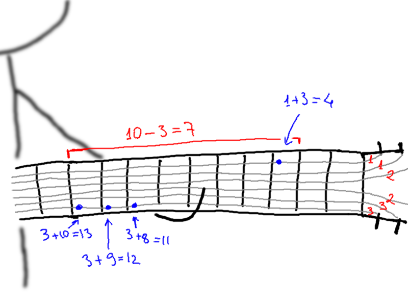
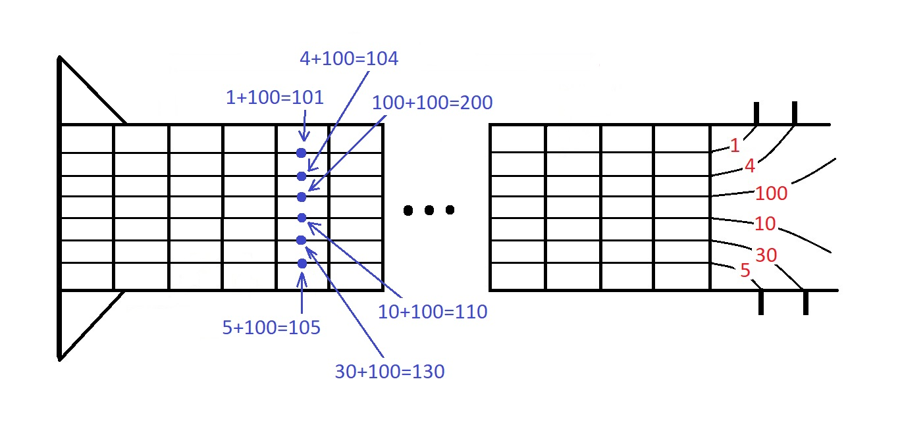
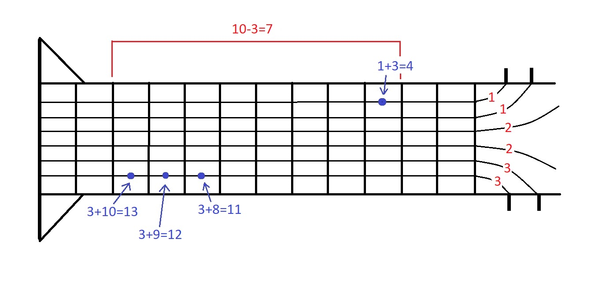

<h1 style='text-align: center;'> C. Perform Easily</h1>

<h5 style='text-align: center;'>time limit per test: 2 seconds</h5>
<h5 style='text-align: center;'>memory limit per test: 256 megabytes</h5>

After battling Shikamaru, Tayuya decided that her flute is too predictable, and replaced it with a guitar. The guitar has $6$ strings and an infinite number of frets numbered from $1$. Fretting the fret number $j$ on the $i$-th string produces the note $a_{i} + j$.

Tayuya wants to play a melody of $n$ notes. Each note can be played on different string-fret combination. The easiness of performance depends on the difference between the maximal and the minimal indices of used frets. The less this difference is, the easier it is to perform the technique. Please determine the minimal possible difference.

For example, if $a = [1, 1, 2, 2, 3, 3]$, and the sequence of notes is $4, 11, 11, 12, 12, 13, 13$ (corresponding to the second example), we can play the first note on the first string, and all the other notes on the sixth string. Then the maximal fret will be $10$, the minimal one will be $3$, and the answer is $10 - 3 = 7$, as shown on the picture.

  ## Input

The first line contains $6$ space-separated numbers $a_{1}$, $a_{2}$, ..., $a_{6}$ ($1 \leq a_{i} \leq 10^{9}$) which describe the Tayuya's strings.

The second line contains the only integer $n$ ($1 \leq n \leq 100\,000$) standing for the number of notes in the melody.

The third line consists of $n$ integers $b_{1}$, $b_{2}$, ..., $b_{n}$ ($1 \leq b_{i} \leq 10^{9}$), separated by space. They describe the notes to be played. It's guaranteed that $b_i > a_j$ for all $1\leq i\leq n$ and $1\leq j\leq 6$, in other words, you can play each note on any string.

## Output

Print the minimal possible difference of the maximal and the minimal indices of used frets.

## Examples

## Input


```

1 4 100 10 30 5
6
101 104 105 110 130 200

```
## Output


```

0

```
## Input


```

1 1 2 2 3 3
7
13 4 11 12 11 13 12

```
## Output


```

7

```
## Note

In the first sample test it is optimal to play the first note on the first string, the second note on the second string, the third note on the sixth string, the fourth note on the fourth string, the fifth note on the fifth string, and the sixth note on the third string. In this case the $100$-th fret is used each time, so the difference is $100 - 100 = 0$.

  In the second test it's optimal, for example, to play the second note on the first string, and all the other notes on the sixth string. Then the maximal fret will be $10$, the minimal one will be $3$, and the answer is $10 - 3 = 7$.

  

#### tags 

#1900 #binary_search #brute_force #dp #implementation #sortings #two_pointers 