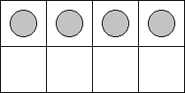
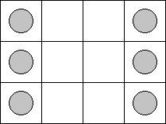

<h1 style='text-align: center;'> B. Help General</h1>

<h5 style='text-align: center;'>time limit per test: 2 seconds</h5>
<h5 style='text-align: center;'>memory limit per test: 256 megabytes</h5>

Once upon a time in the Kingdom of Far Far Away lived Sir Lancelot, the chief Royal General. He was very proud of his men and he liked to invite the King to come and watch drill exercises which demonstrated the fighting techniques and tactics of the squad he was in charge of. But time went by and one day Sir Lancelot had a major argument with the Fairy Godmother (there were rumors that the argument occurred after the general spoke badly of the Godmother's flying techniques. That seemed to hurt the Fairy Godmother very deeply). 

As the result of the argument, the Godmother put a rather strange curse upon the general. It sounded all complicated and quite harmless: "If the squared distance between some two soldiers equals to 5, then those soldiers will conflict with each other!"

The drill exercises are held on a rectangular *n* × *m* field, split into *nm* square 1 × 1 segments for each soldier. Thus, the square of the distance between the soldiers that stand on squares (*x*1, *y*1) and (*x*2, *y*2) equals exactly (*x*1 - *x*2)2 + (*y*1 - *y*2)2. Now not all *nm* squad soldiers can participate in the drill exercises as it was before the Fairy Godmother's curse. Unless, of course, the general wants the soldiers to fight with each other or even worse... For example, if he puts a soldier in the square (2, 2), then he cannot put soldiers in the squares (1, 4), (3, 4), (4, 1) and (4, 3) — each of them will conflict with the soldier in the square (2, 2).

Your task is to help the general. You are given the size of the drill exercise field. You are asked to calculate the maximum number of soldiers that can be simultaneously positioned on this field, so that no two soldiers fall under the Fairy Godmother's curse.

## Input

The single line contains space-separated integers *n* and *m* (1 ≤ *n*, *m* ≤ 1000) that represent the size of the drill exercise field.

## Output

Print the desired maximum number of warriors.

## Examples

## Input


```
2 4  

```
## Output


```
4
```
## Input


```
3 4  

```
## Output


```
6
```
## Note

In the first sample test Sir Lancelot can place his 4 soldiers on the 2 × 4 court as follows (the soldiers' locations are marked with gray circles on the scheme):

  In the second sample test he can place 6 soldiers on the 3 × 4 site in the following manner:

  

#### tags 

#1800 #constructive_algorithms #greedy #implementation 