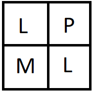
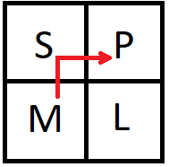

<h1 style='text-align: center;'> D. Does anyone else hate the wind?</h1>

<h5 style='text-align: center;'>time limit per test: 1 second</h5>
<h5 style='text-align: center;'>memory limit per test: 256 megabytes</h5>

Mark and his crew are sailing across the sea of Aeolus (in Greek mythology Aeolus was the keeper of the winds). They have the map which represents the $N$x$M$ matrix with land and sea fields and they want to get to the port (the port is considered as sea field). They are in a hurry because the wind there is very strong and changeable and they have the food for only $K$ days on the sea (that is the maximum that they can carry on the ship). John, the guy from Mark's crew, knows how to predict the direction of the wind on daily basis for $W$ days which is enough time for them to reach the port or to run out of the food. Mark can move the ship in four directions (north, east, south, west) by one field for one day, but he can also stay in the same place. Wind can blow in four directions (north, east, south, west) or just not blow that day. The wind is so strong at the sea of Aeolus that it moves the ship for one whole field in the direction which it blows at. The ship's resulting movement is the sum of the ship's action and wind from that day. Mark must be careful in order to keep the ship on the sea, the resulting movement must end on the sea field and there must be a 4-connected path through the sea from the starting field. A 4-connected path is a path where you can go from one cell to another only if they share a side.

For example in the following image, the ship can't move to the port as there is no 4-connected path through the sea. 

  In the next image, the ship can move to the port as there is a 4-connected path through the sea as shown with the red arrow. Furthermore, the ship can move to the port in one move if one of the following happens. Wind is blowing east and Mark moves the ship north, or wind is blowing north and Mark moves the ship east. In either of these scenarios the ship will end up in the port in one move. 

  Mark must also keep the ship on the map because he doesn't know what is outside. Lucky for Mark and his crew, there are $T$ fish shops at the sea where they can replenish their food supplies to the maximum, but each shop is working on only one day. That means that Mark and his crew must be at the shop's position on the exact working day in order to replenish their food supplies. Help Mark to find the minimum of days that he and his crew need to reach the port or print $-1$ if that is impossible with the food supplies that they have.

## Input

First line contains two integer numbers $N$ and $M$ ($1 \leq N, M \leq 200$) - representing the number of rows and number of columns of the map. 

Second line contains three integers, $K$ ($0 \leq K \leq 200$) which is the number of days with the available food supplies, $T$ ($0 \leq T \leq 20$) which is the number of fields with additional food supplies and $W$ ($0 \leq W \leq 10^6$) which is the number of days with wind information.

Next is the $N$x$M$ char matrix filled with the values of 'L', 'S', 'P' or 'M'. 'L' is for the land and 'S' is for the sea parts. 'P' is for the port field and 'M' is the starting field for the ship.

Next line contains $W$ chars with the wind direction information for every day. The possible inputs are 'N' - north, 'S' - south, 'E' - east, 'W' - west and 'C' - no wind. If Mark's crew can reach the port, it is guaranteed that they will not need more than $W$ days to reach it.

In the end there are $T$ lines with the food supplies positions. Each line contains three integers, $Y_i$ and $X_i$ ($0 \leq Y_i < N, 0 \leq X_i < M$) representing the coordinates (Y is row number and X is column number) of the food supply and $F_i$ ($0 \leq F_i \leq 10^6$) representing the number of days from the starting day on which the food supply is available.

## Output

One integer number representing the minimal days to reach the port or $-1$ if that is impossible.

## Examples

## Input


```

3 3
5 2 15
M S S
S S S
S S P
S W N N N N N N N N N N N N N
2 1 0
1 2 0

```
## Output


```

-1
```
## Input


```

3 3
5 2 15
M S S
S S S
S S P
S E N N N N N N N N N N N N N
2 1 0
1 2 0

```
## Output


```

2
```
## Input


```

5 5
4 1 15
M S S S S
S S S S L
S S S L L
S S S S S
S S S S P
C C C C S S E E C C C C C C C
0 1 4

```
## Output


```

8
```


#### tags 

#3100 