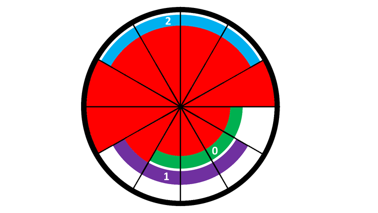
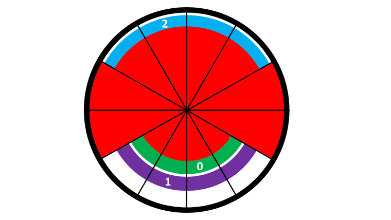
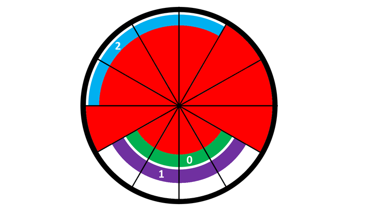
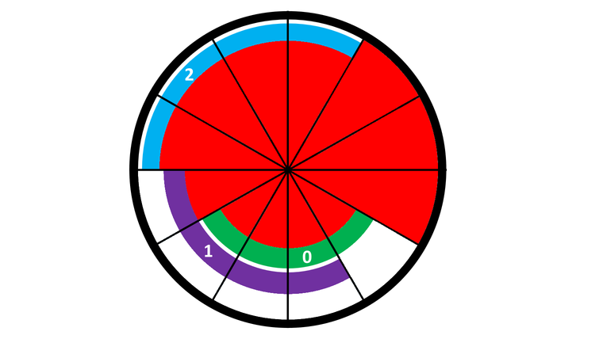

<h1 style='text-align: center;'> H. Rotary Laser Lock</h1>

<h5 style='text-align: center;'>time limit per test: 1 second</h5>
<h5 style='text-align: center;'>memory limit per test: 256 megabytes</h5>

This is an interactive problem.

To prevent the mischievous rabbits from freely roaming around the zoo, Zookeeper has set up a special lock for the rabbit enclosure. This lock is called the Rotary Laser Lock. 

 The lock consists of $n$ concentric rings numbered from $0$ to $n-1$. The innermost ring is ring $0$ and the outermost ring is ring $n-1$. All rings are split equally into $nm$ sections each. Each of those rings contains a single metal arc that covers exactly $m$ contiguous sections. At the center of the ring is a core and surrounding the entire lock are $nm$ receivers aligned to the $nm$ sections.

 The core has $nm$ lasers that shine outward from the center, one for each section. The lasers can be blocked by any of the arcs. A display on the outside of the lock shows how many lasers hit the outer receivers.

 

  In the example above, there are $n=3$ rings, each covering $m=4$ sections. The arcs are colored in green (ring $0$), purple (ring $1$), and blue (ring $2$) while the lasers beams are shown in red. There are $nm=12$ sections and $3$ of the lasers are not blocked by any arc, thus the display will show $3$ in this case.

 Wabbit is trying to open the lock to free the rabbits, but the lock is completely opaque, and he cannot see where any of the arcs are. Given the relative positions of the arcs, Wabbit can open the lock on his own. 

 To be precise, Wabbit needs $n-1$ integers $p_1,p_2,\ldots,p_{n-1}$ satisfying $0 \leq p_i < nm$ such that for each $i$ $(1 \leq i < n)$, Wabbit can rotate ring $0$ clockwise exactly $p_i$ times such that the sections that ring $0$ covers perfectly aligns with the sections that ring $i$ covers. In the example above, the relative positions are $p_1 = 1$ and $p_2 = 7$.

 To operate the lock, he can pick any of the $n$ rings and rotate them by $1$ section either clockwise or anti-clockwise. You will see the number on the display after every rotation.

Because his paws are small, Wabbit has asked you to help him to find the relative positions of the arcs after all of your rotations are completed. You may perform up to $15000$ rotations before Wabbit gets impatient.

## Input

The first line consists of 2 integers $n$ and $m$ $(2 \leq n \leq 100, 2 \leq m \leq 20)$, indicating the number of rings and the number of sections each ring covers.

## Interaction

To perform a rotation, print on a single line "? x d" where $x$ $(0 \leq x < n)$ is the ring that you wish to rotate and $d$ $(d \in \{-1,1\})$ is the direction that you would like to rotate in. $d=1$ indicates a clockwise rotation by $1$ section while $d=-1$ indicates an anticlockwise rotation by $1$ section.

 For each query, you will receive a single integer $a$: the number of lasers that are not blocked by any of the arcs after the rotation has been performed.

Once you have figured out the relative positions of the arcs, print ! followed by $n-1$ integers $p_1, p_2, \ldots, p_{n-1}$. 

 Do note that the positions of the rings are predetermined for each test case and won't change during the interaction process.

 After printing a query do not forget to output the end of line and flush the output. Otherwise, you will get Idleness limit exceeded verdict.

To do this, use:

* fflush(stdout) or cout.flush() in C++;
* System.out.flush() in Java;
* flush(output) in Pascal;
* stdout.flush() in Python;
* see documentation for other languages.

Hacks:

To hack, use the following format of test:

 The first line should contain two integers $n$ and $m$.

 The next line of should contain $n-1$ integers $p_1,p_2,\ldots,p_{n-1}$: relative positions of rings $1,2,\ldots,n-1$.

## Example

## Input


```

3 4

4

4

3

```
Output
```


? 0 1

? 2 -1

? 1 1

! 1 5
```
## Note

For the first test, the configuration is the same as shown on the picture from the statement.

 After the first rotation (which is rotating ring $0$ clockwise by $1$ section), we obtain the following configuration:

 

  After the second rotation (which is rotating ring $2$ counter-clockwise by $1$ section), we obtain the following configuration:

 

  After the third rotation (which is rotating ring $1$ clockwise by $1$ section), we obtain the following configuration:

 

  If we rotate ring $0$ clockwise once, we can see that the sections ring $0$ covers will be the same as the sections that ring $1$ covers, hence $p_1=1$.

If we rotate ring $0$ clockwise five times, the sections ring $0$ covers will be the same as the sections that ring $2$ covers, hence $p_2=5$.

## Note

 that if we will make a different set of rotations, we can end up with different values of $p_1$ and $p_2$ at the end.


#### tags 

#3500 #binary_search #interactive 