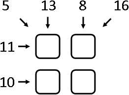
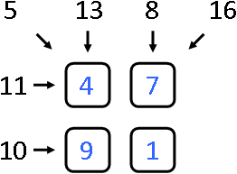
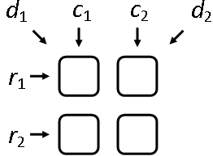

<h1 style='text-align: center;'> A. Help Vasilisa the Wise 2</h1>

<h5 style='text-align: center;'>time limit per test: 2 seconds</h5>
<h5 style='text-align: center;'>memory limit per test: 256 megabytes</h5>

Vasilisa the Wise from the Kingdom of Far Far Away got a magic box with a secret as a present from her friend Hellawisa the Wise from the Kingdom of A Little Closer. However, Vasilisa the Wise does not know what the box's secret is, since she cannot open it again. She hopes that you will help her one more time with that.

The box's lock looks as follows: it contains 4 identical deepenings for gems as a 2 × 2 square, and some integer numbers are written at the lock's edge near the deepenings. The example of a lock is given on the picture below.

  The box is accompanied with 9 gems. Their shapes match the deepenings' shapes and each gem contains one number from 1 to 9 (each number is written on exactly one gem). The box will only open after it is decorated with gems correctly: that is, each deepening in the lock should be filled with exactly one gem. Also, the sums of numbers in the square's rows, columns and two diagonals of the square should match the numbers written at the lock's edge. For example, the above lock will open if we fill the deepenings with gems with numbers as is shown on the picture below.

  Now Vasilisa the Wise wants to define, given the numbers on the box's lock, which gems she should put in the deepenings to open the box. Help Vasilisa to solve this challenging task.

## Input

The input contains numbers written on the edges of the lock of the box. The first line contains space-separated integers *r*1 and *r*2 that define the required sums of numbers in the rows of the square. The second line contains space-separated integers *c*1 and *c*2 that define the required sums of numbers in the columns of the square. The third line contains space-separated integers *d*1 and *d*2 that define the required sums of numbers on the main and on the side diagonals of the square (1 ≤ *r*1, *r*2, *c*1, *c*2, *d*1, *d*2 ≤ 20). Correspondence between the above 6 variables and places where they are written is shown on the picture below. For more clarifications please look at the second sample test that demonstrates the example given in the problem statement.

  ## Output

Print the scheme of decorating the box with stones: two lines containing two space-separated integers from 1 to 9. The numbers should be pairwise different. If there is no solution for the given lock, then print the single number "-1" (without the quotes).

If there are several solutions, output any.

## Examples

## Input


```
3 7  
4 6  
5 5  

```
## Output


```
1 2  
3 4  

```
## Input


```
11 10  
13 8  
5 16  

```
## Output


```
4 7  
9 1  

```
## Input


```
1 2  
3 4  
5 6  

```
## Output


```
-1  

```
## Input


```
10 10  
10 10  
10 10  

```
## Output


```
-1  

```
## Note

Pay attention to the last test from the statement: it is impossible to open the box because for that Vasilisa the Wise would need 4 identical gems containing number "5". However, Vasilisa only has one gem with each number from 1 to 9.


#### tags 

#1000 #brute_force #math 