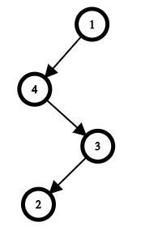
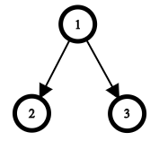

<h1 style='text-align: center;'> D. Minimal Height Tree</h1>

<h5 style='text-align: center;'>time limit per test: 2 seconds</h5>
<h5 style='text-align: center;'>memory limit per test: 256 megabytes</h5>

Monocarp had a tree which consisted of $n$ vertices and was rooted at vertex $1$. He decided to study BFS ([Breadth-first search](https://en.wikipedia.org/wiki/Breadth-first_search)), so he ran BFS on his tree, starting from the root. BFS can be described by the following pseudocode:


```
a = [] # the order in which vertices were processed  
q = Queue()  
q.put(1) # place the root at the end of the queue  
while not q.empty():  
    k = q.pop() # retrieve the first vertex from the queue  
    a.append(k) # append k to the end of the sequence in which vertices were visited  
    for y in g[k]: # g[k] is the list of all children of vertex k, sorted in ascending order  
        q.put(y)  

```
Monocarp was fascinated by BFS so much that, in the end, he lost his tree. Fortunately, he still has a sequence of vertices, in which order vertices were visited by the BFS algorithm (the array a from the pseudocode). Monocarp knows that each vertex was visited exactly once (since they were put and taken from the queue exactly once). Also, he knows that all children of each vertex were viewed in ascending order.

Monocarp knows that there are many trees (in the general case) with the same visiting order $a$, so he doesn't hope to restore his tree. Monocarp is okay with any tree that has minimum height.

The height of a tree is the maximum depth of the tree's vertices, and the depth of a vertex is the number of edges in the path from the root to it. For example, the depth of vertex $1$ is $0$, since it's the root, and the depth of all root's children are $1$.

Help Monocarp to find any tree with given visiting order $a$ and minimum height.

## Input

The first line contains a single integer $t$ ($1 \le t \le 1000$) — the number of test cases.

The first line of each test case contains a single integer $n$ ($2 \le n \le 2 \cdot 10^5$) — the number of vertices in the tree.

The second line of each test case contains $n$ integers $a_1, a_2, \dots, a_n$ ($1 \le a_i \le n$; $a_i \neq a_j$; $a_1 = 1$) — the order in which the vertices were visited by the BFS algorithm.

It's guaranteed that the total sum of $n$ over test cases doesn't exceed $2 \cdot 10^5$.

## Output

For each test case print the minimum possible height of a tree with the given visiting order $a$.

## Example

## Input


```

3
4
1 4 3 2
2
1 2
3
1 2 3

```
## Output


```

3
1
1

```
## Note

In the first test case, there is only one tree with the given visiting order: 

  In the second test case, there is only one tree with the given visiting order as well: 

  In the third test case, an optimal tree with the given visiting order is shown below: 

  

#### tags 

#1600 #graphs #greedy #shortest_paths #trees 