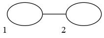
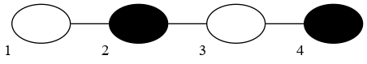
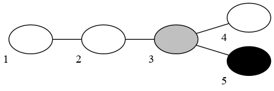
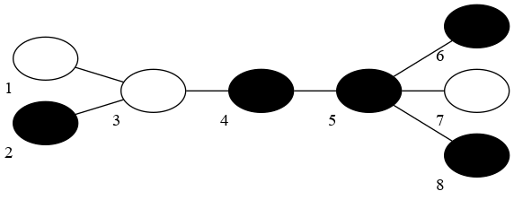

<h1 style='text-align: center;'> E. Black, White and Grey Tree</h1>

<h5 style='text-align: center;'>time limit per test: 2 seconds</h5>
<h5 style='text-align: center;'>memory limit per test: 512 megabytes</h5>

You are given a tree with each vertex coloured white, black or grey. You can remove elements from the tree by selecting a subset of vertices in a single connected component and removing them and their adjacent edges from the graph. The only restriction is that you are not allowed to select a subset containing a white and a black vertex at once.

What is the minimum number of removals necessary to remove all vertices from the tree?

## Input

Each test contains multiple test cases. The first line contains an integer $t$ ($1 \le t \le 100\,000$), denoting the number of test cases, followed by a description of the test cases.

The first line of each test case contains an integer $n$ ($1 \le n \le 200\,000$): the number of vertices in the tree.

The second line of each test case contains $n$ integers $a_v$ ($0 \le a_v \le 2$): colours of vertices. Gray vertices have $a_v=0$, white have $a_v=1$, black have $a_v=2$.

Each of the next $n-1$ lines contains two integers $u, v$ ($1 \le u, v \le n$): tree edges.

The sum of all $n$ throughout the test is guaranteed to not exceed $200\,000$.

## Output

For each test case, print one integer: the minimum number of operations to solve the problem.

## Example

## Input


```

4
2
1 1
1 2
4
1 2 1 2
1 2
2 3
3 4
5
1 1 0 1 2
1 2
2 3
3 4
3 5
8
1 2 1 2 2 2 1 2
1 3
2 3
3 4
4 5
5 6
5 7
5 8

```
## Output


```

1
3
2
3

```
## Note



In the first test case, both vertices are white, so you can remove them at the same time.



In the second test case, three operations are enough. First, we need to remove both black vertices (2 and 4), then separately remove vertices 1 and 3. We can't remove them together because they end up in different connectivity components after vertex 2 is removed.



In the third test case, we can remove vertices 1, 2, 3, 4 at the same time, because three of them are white and one is grey. After that, we can remove vertex 5.



In the fourth test case, three operations are enough. One of the ways to solve the problem is to remove all black vertices at once, then remove white vertex 7, and finally, remove connected white vertices 1 and 3.


#### tags 

#3000 #binary_search #constructive_algorithms #dfs_and_similar #dp #greedy #trees 