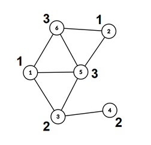

<h1 style='text-align: center;'> C. Team-Building</h1>

<h5 style='text-align: center;'>time limit per test: 3 seconds</h5>
<h5 style='text-align: center;'>memory limit per test: 512 megabytes</h5>

The new academic year has started, and Berland's university has $n$ first-year students. They are divided into $k$ academic groups, however, some of the groups might be empty. Among the students, there are $m$ pairs of acquaintances, and each acquaintance pair might be both in a common group or be in two different groups.

Alice is the curator of the first years, she wants to host an entertaining game to make everyone know each other. To do that, she will select two different academic groups and then divide the students of those groups into two teams. The game requires that there are no acquaintance pairs inside each of the teams.

Alice wonders how many pairs of groups she can select, such that it'll be possible to play a game after that. All students of the two selected groups must take part in the game.

Please note, that the teams Alice will form for the game don't need to coincide with groups the students learn in. Moreover, teams may have different sizes (or even be empty).

## Input

The first line contains three integers $n$, $m$ and $k$ ($1 \le n \le 500\,000$; $0 \le m \le 500\,000$; $2 \le k \le 500\,000$) — the number of students, the number of pairs of acquaintances and the number of groups respectively.

The second line contains $n$ integers $c_1, c_2, \dots, c_n$ ($1 \le c_i \le k$), where $c_i$ equals to the group number of the $i$-th student.

Next $m$ lines follow. The $i$-th of them contains two integers $a_i$ and $b_i$ ($1 \le a_i, b_i \le n$), denoting that students $a_i$ and $b_i$ are acquaintances. It's guaranteed, that $a_i \neq b_i$, and that no (unordered) pair is mentioned more than once.

## Output

Print a single integer — the number of ways to choose two different groups such that it's possible to select two teams to play the game.

## Examples

## Input


```

6 8 3
1 1 2 2 3 3
1 3
1 5
1 6
2 5
2 6
3 4
3 5
5 6

```
## Output


```

2

```
## Input


```

4 3 3
1 1 2 2
1 2
2 3
3 4

```
## Output


```

3

```
## Input


```

4 4 2
1 1 1 2
1 2
2 3
3 1
1 4

```
## Output


```

0

```
## Input


```

5 5 2
1 2 1 2 1
1 2
2 3
3 4
4 5
5 1

```
## Output


```

0

```
## Note

The acquaintances graph for the first example is shown in the picture below (next to each student there is their group number written).



In that test we can select the following groups:

* Select the first and the second groups. For instance, one team can be formed from students $1$ and $4$, while other team can be formed from students $2$ and $3$.
* Select the second and the third group. For instance, one team can be formed $3$ and $6$, while other team can be formed from students $4$ and $5$.
* We can't select the first and the third group, because there is no way to form the teams for the game.

In the second example, we can select any group pair. Please note, that even though the third group has no students, we still can select it (with some other group) for the game.


#### tags 

#2500 #data_structures #dfs_and_similar #dsu #graphs 