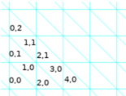
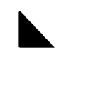

<h1 style='text-align: center;'> E. Long Recovery</h1>

<h5 style='text-align: center;'>time limit per test: 3 seconds</h5>
<h5 style='text-align: center;'>memory limit per test: 256 megabytes</h5>

A patient has been infected with an unknown disease. His body can be seen as an infinite grid of triangular cells which looks as follows:

  Two cells are neighboring if they share a side. Therefore, each cell ($x$, $y$) has exactly three neighbors: 

* ($x+1$, $y$)
* ($x-1$, $y$)
* ($x+1$, $y-1$) if $x$ is even and ($x-1$, $y+1$) otherwise.

 Initially some cells are infected, all the others are healthy. The process of recovery begins. Each second, for exactly one cell (even though there might be multiple cells that could change its state) one of the following happens:

* A healthy cell with at least $2$ infected neighbors also becomes infected.
* An infected cell with at least $2$ healthy neighbors also becomes healthy.

If no such cell exists, the process of recovery stops. Patient is considered recovered if the process of recovery has stopped and all the cells are healthy.

We're interested in a worst-case scenario: is it possible that the patient never recovers, or if it's not possible, what is the maximum possible duration of the recovery process?

## Input

The first line contains one integer $n$ $(1 \leq n \leq 250000)$  — the number of infected cells. 

The $i$-th of the next $n$ lines contains two space-separated integers $x_i$ and $y_i$ $(0 \leq x_i, y_i < 500)$, meaning that cell $(x_i, y_i)$ is infected. All cells $(x_i, y_i)$ are distinct, and all other cells are considered healthy. 

## Output

If it is possible that the organism never fully recovers from the disease, print SICK. Otherwise, you should print RECOVERED and in the next line an integer $k$  — the longest possible recovery period, modulo $998244353$. 

## Examples

## Input


```

4
0 0
1 0
2 0
0 1

```
## Output


```

RECOVERED
4

```
## Input


```

3
1 0
3 0
1 1

```
## Output


```

SICK

```
## Note

For the first testcase, the following drawings describe the longest possible recovery process. It can be proven that there are no recovery periods of length $5$ or longer, and the organism always recovers in this testcase.

 $\hspace{40pt} \downarrow$  $\hspace{40pt} \downarrow$  $\hspace{40pt} \downarrow$  $\hspace{40pt} \downarrow$

$\hspace{15pt}$ RECOVERED

For the second testcase, it is possible for the cells $(2, 0)$, $(2, 1)$, $(0, 1)$ to become infected. After that, no cell can change its state, so the answer is SICK, as not all of the cells are healthy.


#### tags 

#3500 #constructive_algorithms #dfs_and_similar 