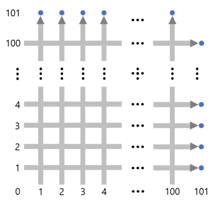
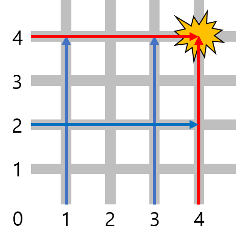

<h1 style='text-align: center;'> A. Cancel the Trains</h1>

<h5 style='text-align: center;'>time limit per test: 1 second</h5>
<h5 style='text-align: center;'>memory limit per test: 512 megabytes</h5>

Gildong's town has a train system that has $100$ trains that travel from the bottom end to the top end and $100$ trains that travel from the left end to the right end. The trains starting from each side are numbered from $1$ to $100$, respectively, and all trains have the same speed. Let's take a look at the picture below.

  The train system can be represented as coordinates on a 2D plane. The $i$-th train starting at the bottom end is initially at $(i,0)$ and will be at $(i,T)$ after $T$ minutes, and the $i$-th train starting at the left end is initially at $(0,i)$ and will be at $(T,i)$ after $T$ minutes. All trains arrive at their destinations after $101$ minutes.

However, Gildong found that some trains scheduled to depart at a specific time, simultaneously, are very dangerous. At this time, $n$ trains are scheduled to depart from the bottom end and $m$ trains are scheduled to depart from the left end. If two trains are both at $(x,y)$ at the same time for some $x$ and $y$, they will crash into each other. Therefore, he is asking you to find the minimum number of trains that should be cancelled to prevent all such crashes.

## Input

Each test contains one or more test cases. The first line contains the number of test cases $t$ ($1 \le t \le 100$).

Each test case contains three lines. The first line of each test case consists of two integers $n$ and $m$ ($1 \le n, m \le 100$) — the number of trains scheduled to depart from the bottom end, and the number of trains scheduled to depart from the left end, respectively.

The second line of each test case contains $n$ integers. Each integer is a train number that is scheduled to start from the bottom end. The numbers are given in strictly increasing order, and are between $1$ and $100$, inclusive.

The third line of each test case contains $m$ integers. Each integer is a train number that is scheduled to start from the left end. The numbers are given in strictly increasing order, and are between $1$ and $100$, inclusive.

## Output

For each test case, print a single integer: the minimum number of trains that should be canceled in order to prevent all crashes.

## Example

## Input


```

3
1 2
1
3 4
3 2
1 3 4
2 4
9 14
2 7 16 28 33 57 59 86 99
3 9 14 19 25 26 28 35 41 59 85 87 99 100

```
## Output


```

0
1
3

```
## Note

In the first case, we can show that there will be no crashes if the current schedule is followed. Therefore, the answer is zero.

In the second case, at $T=4$, there will be a crash, as can be seen in the picture below. We can prove that after canceling one of these trains, the remaining trains will not crash. Therefore, the answer is one.

  

#### tags 

#800 #implementation 