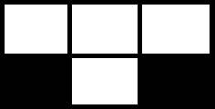

<h1 style='text-align: center;'> F. New Year's Puzzle</h1>

<h5 style='text-align: center;'>time limit per test: 2 seconds</h5>
<h5 style='text-align: center;'>memory limit per test: 256 megabytes</h5>

Every year Santa Claus gives gifts to all children. However, each country has its own traditions, and this process takes place in different ways. For example, in Berland you need to solve the New Year's puzzle.

Polycarp got the following problem: given a grid strip of size $2 \times n$, some cells of it are blocked. You need to check if it is possible to tile all free cells using the $2 \times 1$ and $1 \times 2$ tiles (dominoes).

For example, if $n = 5$ and the strip looks like this (black cells are blocked):

  Then it can be tiled, for example, using two vertical and two horizontal tiles, as in the picture below (different tiles are marked by different colors).

  And if $n = 3$ and the strip looks like this:

  It is impossible to tile free cells.

Polycarp easily solved this task and received his New Year's gift. Can you solve it?

## Input

The first line contains an integer $t$ ($1 \leq t \leq 10^4$) — the number of test cases. Then $t$ test cases follow.

Each test case is preceded by an empty line.

The first line of each test case contains two integers $n$ and $m$ ($1 \le n \le 10^9$, $1 \le m \le 2 \cdot 10^5$) — the length of the strip and the number of blocked cells on it.

Each of the next $m$ lines contains two integers $r_i, c_i$ ($1 \le r_i \le 2, 1 \le c_i \le n$) — numbers of rows and columns of blocked cells. It is guaranteed that all blocked cells are different, i.e. $(r_i, c_i) \ne (r_j, c_j), i \ne j$.

It is guaranteed that the sum of $m$ over all test cases does not exceed $2 \cdot 10^5$.

## Output

For each test case, print on a separate line: 

* "YES", if it is possible to tile all unblocked squares with the $2 \times 1$ and $1 \times 2$ tiles;
* "NO" otherwise.

You can output "YES" and "NO" in any case (for example, the strings yEs, yes, Yes and YES will be recognized as positive).

## Example

## Input


```

3

5 2
2 2
1 4

3 2
2 1
2 3

6 4
2 1
2 3
2 4
2 6

```
## Output


```

YES
NO
NO

```
## Note

The first two test cases are explained in the statement.

In the third test case the strip looks like this: 

   It is easy to check that the unblocked squares on it can not be tiled.

#### tags 

#2100 #brute_force #dp #graph_matchings #greedy #sortings 