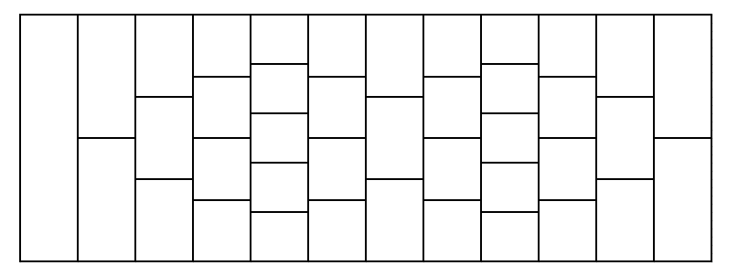

<h1 style='text-align: center;'> G. Tiles</h1>

<h5 style='text-align: center;'>time limit per test: 4 seconds</h5>
<h5 style='text-align: center;'>memory limit per test: 256 megabytes</h5>

Consider a road consisting of several rows. Each row is divided into several rectangular tiles, and all tiles in the same row are equal. The first row contains exactly one rectangular tile. Look at the picture below which shows how the tiles are arranged.

The road is constructed as follows: 

* the first row consists of $1$ tile;
* then $a_1$ rows follow; each of these rows contains $1$ tile greater than the previous row;
* then $b_1$ rows follow; each of these rows contains $1$ tile less than the previous row;
* then $a_2$ rows follow; each of these rows contains $1$ tile greater than the previous row;
* then $b_2$ rows follow; each of these rows contains $1$ tile less than the previous row;
* ...
* then $a_n$ rows follow; each of these rows contains $1$ tile greater than the previous row;
* then $b_n$ rows follow; each of these rows contains $1$ tile less than the previous row.

  An example of the road with $n = 2$, $a_1 = 4$, $b_1 = 2$, $a_2 = 2$, $b_2 = 3$. Rows are arranged from left to right. You start from the only tile in the first row and want to reach the last row (any tile of it). From your current tile, you can move to any tile in the next row which touches your current tile.

Calculate the number of different paths from the first row to the last row. Since it can be large, print it modulo $998244353$.

## Input

The first line contains one integer $n$ ($1 \le n \le 1000$).

Then $n$ lines follow. The $i$-th of them contains two integers $a_i$ and $b_i$ ($1 \le a_i, b_i \le 10^5$; $|a_i - b_i| \le 5$).

Additional constraint on the input: the sequence of $a_i$ and $b_i$ never results in a row with non-positive number of tiles.

## Output

Print one integer — the number of paths from the first row to the last row, taken modulo $998244353$.

## Examples

## Input


```

2
4 2
2 3

```
## Output


```

850

```
## Input


```

3
4 1
2 3
3 1

```
## Output


```

10150

```
## Input


```

8
328 323
867 868
715 718
721 722
439 435
868 870
834 834
797 796

```
## Output


```

759099319

```


#### tags 

#2800 #combinatorics #dp #fft #math 