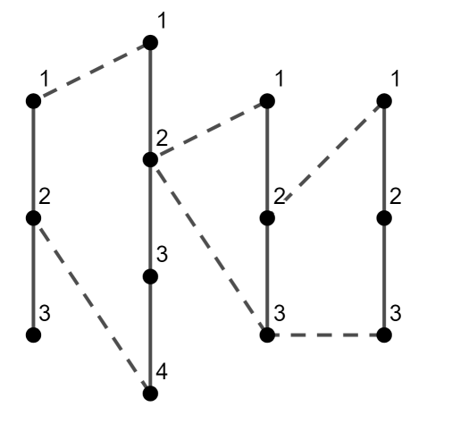
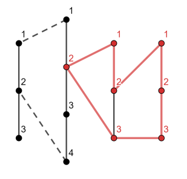

<h1 style='text-align: center;'> C. Longest Simple Cycle</h1>

<h5 style='text-align: center;'>time limit per test: 2 seconds</h5>
<h5 style='text-align: center;'>memory limit per test: 256 megabytes</h5>

You have $n$ chains, the $i$-th chain consists of $c_i$ vertices. Vertices in each chain are numbered independently from $1$ to $c_i$ along the chain. In other words, the $i$-th chain is the undirected graph with $c_i$ vertices and $(c_i - 1)$ edges connecting the $j$-th and the $(j + 1)$-th vertices for each $1 \le j < c_i$.

Now you decided to unite chains in one graph in the following way: 

1. the first chain is skipped;
2. the $1$-st vertex of the $i$-th chain is connected by an edge with the $a_i$-th vertex of the $(i - 1)$-th chain;
3. the last ($c_i$-th) vertex of the $i$-th chain is connected by an edge with the $b_i$-th vertex of the $(i - 1)$-th chain.

  Picture of the first test case. Dotted lines are the edges added during uniting process Calculate the length of the longest simple cycle in the resulting graph.

A simple cycle is a chain where the first and last vertices are connected as well. If you travel along the simple cycle, each vertex of this cycle will be visited exactly once.

## Input

The first line contains a single integer $t$ ($1 \le t \le 1000$) — the number of test cases.

The first line of each test case contains the single integer $n$ ($2 \le n \le 10^5$) — the number of chains you have.

The second line of each test case contains $n$ integers $c_1, c_2, \dots, c_n$ ($2 \le c_i \le 10^9$) — the number of vertices in the corresponding chains.

The third line of each test case contains $n$ integers $a_1, a_2, \dots, a_n$ ($a_1 = -1$; $1 \le a_i \le c_{i - 1}$).

The fourth line of each test case contains $n$ integers $b_1, b_2, \dots, b_n$ ($b_1 = -1$; $1 \le b_i \le c_{i - 1}$).

Both $a_1$ and $b_1$ are equal to $-1$, they aren't used in graph building and given just for index consistency. It's guaranteed that the sum of $n$ over all test cases doesn't exceed $10^5$.

## Output

For each test case, print the length of the longest simple cycle.

## Example

## Input


```

3
4
3 4 3 3
-1 1 2 2
-1 2 2 3
2
5 6
-1 5
-1 1
3
3 5 2
-1 1 1
-1 3 5

```
## Output


```

7
11
8

```
## Note

In the first test case, the longest simple cycle is shown below: 

  We can't increase it with the first chain, since in such case it won't be simple — the vertex $2$ on the second chain will break simplicity.


#### tags 

#1600 #dp #graphs #greedy 