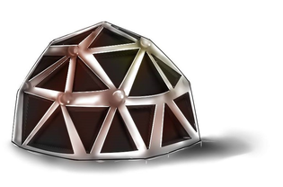

<h1 style='text-align: center;'> B. New Colony</h1>

<h5 style='text-align: center;'>time limit per test: 2 seconds</h5>
<h5 style='text-align: center;'>memory limit per test: 256 megabytes</h5>

After reaching your destination, you want to build a new colony on the new planet. Since this planet has many mountains and the colony must be built on a flat surface you decided to flatten the mountains using boulders (you are still dreaming so this makes sense to you).

  You are given an array $h_1, h_2, \dots, h_n$, where $h_i$ is the height of the $i$-th mountain, and $k$ — the number of boulders you have.

You will start throwing boulders from the top of the first mountain one by one and they will roll as follows (let's assume that the height of the current mountain is $h_i$): 

* if $h_i \ge h_{i + 1}$, the boulder will roll to the next mountain;
* if $h_i < h_{i + 1}$, the boulder will stop rolling and increase the mountain height by $1$ ($h_i = h_i + 1$);
* if the boulder reaches the last mountain it will fall to the waste collection system and disappear.

You want to find the position of the $k$-th boulder or determine that it will fall into the waste collection system.

## Input

The first line contains a single integer $t$ ($1 \le t \le 100$) — the number of test cases.

Each test case consists of two lines. The first line in each test case contains two integers $n$ and $k$ ($1 \le n \le 100$; $1 \le k \le 10^9$) — the number of mountains and the number of boulders.

The second line contains $n$ integers $h_1, h_2, \dots, h_n$ ($1 \le h_i \le 100$) — the height of the mountains.

It is guaranteed that the sum of $n$ over all test cases does not exceed $100$.

## Output

For each test case, print $-1$ if the $k$-th boulder will fall into the collection system. Otherwise, print the position of the $k$-th boulder.

## Example

## Input


```

4
4 3
4 1 2 3
2 7
1 8
4 5
4 1 2 3
3 1
5 3 1

```
## Output


```

2
1
-1
-1

```
## Note

Let's simulate the first case:

* The first boulder starts at $i = 1$; since $h_1 \ge h_2$ it rolls to $i = 2$ and stops there because $h_2 < h_3$.
* The new heights are $[4,2,2,3]$.
* The second boulder starts at $i = 1$; since $h_1 \ge h_2$ the boulder rolls to $i = 2$; since $h_2 \ge h_3$ the boulder rolls to $i = 3$ and stops there because $h_3 < h_4$.
* The new heights are $[4,2,3,3]$.
* The third boulder starts at $i = 1$; since $h_1 \ge h_2$ it rolls to $i = 2$ and stops there because $h_2 < h_3$.
* The new heights are $[4,3,3,3]$.

The positions where each boulder stopped are the following: $[2,3,2]$.

In the second case, all $7$ boulders will stop right at the first mountain rising its height from $1$ to $8$.

The third case is similar to the first one but now you'll throw $5$ boulders. The first three will roll in the same way as in the first test case. After that, mountain heights will be equal to $[4, 3, 3, 3]$, that's why the other two boulders will fall into the collection system.

In the fourth case, the first and only boulders will fall straight into the collection system.


#### tags 

#1100 #brute_force #greedy #implementation 