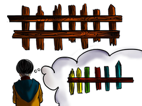

<h1 style='text-align: center;'> C. Fence Painting</h1>

<h5 style='text-align: center;'>time limit per test: 2 seconds</h5>
<h5 style='text-align: center;'>memory limit per test: 256 megabytes</h5>

You finally woke up after this crazy dream and decided to walk around to clear your head. Outside you saw your house's fence — so plain and boring, that you'd like to repaint it.

  You have a fence consisting of $n$ planks, where the $i$-th plank has the color $a_i$. You want to repaint the fence in such a way that the $i$-th plank has the color $b_i$.

You've invited $m$ painters for this purpose. The $j$-th painter will arrive at the moment $j$ and will recolor exactly one plank to color $c_j$. For each painter you can choose which plank to recolor, but you can't turn them down, i. e. each painter has to color exactly one plank.

Can you get the coloring $b$ you want? If it's possible, print for each painter which plank he must paint.

## Input

The first line contains one integer $t$ ($1 \le t \le 10^4$) — the number of test cases. Then $t$ test cases follow.

The first line of each test case contains two integers $n$ and $m$ ($1 \le n, m \le 10^5$) — the number of planks in the fence and the number of painters.

The second line of each test case contains $n$ integers $a_1, a_2, \dots, a_n$ ($1 \le a_i \le n$) — the initial colors of the fence.

The third line of each test case contains $n$ integers $b_1, b_2, \dots, b_n$ ($1 \le b_i \le n$) — the desired colors of the fence.

The fourth line of each test case contains $m$ integers $c_1, c_2, \dots, c_m$ ($1 \le c_j \le n$) — the colors painters have.

It's guaranteed that the sum of $n$ doesn't exceed $10^5$ and the sum of $m$ doesn't exceed $10^5$ over all test cases.

## Output

For each test case, output "NO" if it is impossible to achieve the coloring $b$.

Otherwise, print "YES" and $m$ integers $x_1, x_2, \dots, x_m$, where $x_j$ is the index of plank the $j$-th painter should paint.

You may print every letter in any case you want (so, for example, the strings "yEs", "yes", "Yes" and "YES" are all recognized as positive answer).

## Example

## Input


```

6
1 1
1
1
1
5 2
1 2 2 1 1
1 2 2 1 1
1 2
3 3
2 2 2
2 2 2
2 3 2
10 5
7 3 2 1 7 9 4 2 7 9
9 9 2 1 4 9 4 2 3 9
9 9 7 4 3
5 2
1 2 2 1 1
1 2 2 1 1
3 3
6 4
3 4 2 4 1 2
2 3 1 3 1 1
2 2 3 4

```
## Output


```

YES
1
YES
2 2
YES
1 1 1
YES
2 1 9 5 9
NO
NO

```


#### tags 

#1600 #brute_force #constructive_algorithms #greedy 