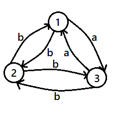

<h1 style='text-align: center;'> D. AB Graph</h1>

<h5 style='text-align: center;'>time limit per test: 2 seconds</h5>
<h5 style='text-align: center;'>memory limit per test: 256 megabytes</h5>

Your friend Salem is Warawreh's brother and only loves math and geometry problems. He has solved plenty of such problems, but according to Warawreh, in order to graduate from university he has to solve more graph problems. Since Salem is not good with graphs he asked your help with the following problem.

  You are given a complete directed graph with $n$ vertices without self-loops. In other words, you have $n$ vertices and each pair of vertices $u$ and $v$ ($u \neq v$) has both directed edges $(u, v)$ and $(v, u)$.

Every directed edge of the graph is labeled with a single character: either 'a' or 'b' (edges $(u, v)$ and $(v, u)$ may have different labels).

You are also given an integer $m > 0$. You should find a path of length $m$ such that the string obtained by writing out edges' labels when going along the path is a palindrome. The length of the path is the number of edges in it.

You can visit the same vertex and the same directed edge any number of times.

## Input

The first line contains a single integer $t$ ($1 \le t \le 500$) — the number of test cases.

The first line of each test case contains two integers $n$ and $m$ ($2 \leq n \leq 1000$; $1 \leq m \leq 10^{5}$) — the number of vertices in the graph and desirable length of the palindrome.

Each of the next $n$ lines contains $n$ characters. The $j$-th character of the $i$-th line describes the character on the edge that is going from node $i$ to node $j$.

Every character is either 'a' or 'b' if $i \neq j$, or '*' if $i = j$, since the graph doesn't contain self-loops.

It's guaranteed that the sum of $n$ over test cases doesn't exceed $1000$ and the sum of $m$ doesn't exceed $10^5$.

## Output

For each test case, if it is possible to find such path, print "YES" and the path itself as a sequence of $m + 1$ integers: indices of vertices in the path in the appropriate order. If there are several valid paths, print any of them.

Otherwise, (if there is no answer) print "NO".

## Example

## Input


```

5
3 1
*ba
b*b
ab*
3 3
*ba
b*b
ab*
3 4
*ba
b*b
ab*
4 6
*aaa
b*ba
ab*a
bba*
2 6
*a
b*

```
## Output


```

YES
1 2
YES
2 1 3 2
YES
1 3 1 3 1
YES
1 2 1 3 4 1 4
NO

```
## Note

The graph from the first three test cases is shown below:

  In the first test case, the answer sequence is $[1,2]$ which means that the path is:

$$1 \xrightarrow{\text{b}} 2$$

So the string that is obtained by the given path is b.

In the second test case, the answer sequence is $[2,1,3,2]$ which means that the path is:

$$2 \xrightarrow{\text{b}} 1 \xrightarrow{\text{a}} 3 \xrightarrow{\text{b}} 2$$

So the string that is obtained by the given path is bab.

In the third test case, the answer sequence is $[1,3,1,3,1]$ which means that the path is:

$$1 \xrightarrow{\text{a}} 3 \xrightarrow{\text{a}} 1 \xrightarrow{\text{a}} 3 \xrightarrow{\text{a}} 1$$

So the string that is obtained by the given path is aaaa.

The string obtained in the fourth test case is abaaba.


#### tags 

#2000 #brute_force #constructive_algorithms #graphs #greedy #implementation 