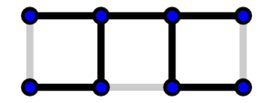

<h1 style='text-align: center;'> A. Prison Break</h1>

<h5 style='text-align: center;'>time limit per test: 1 second</h5>
<h5 style='text-align: center;'>memory limit per test: 256 megabytes</h5>

Michael is accused of violating the social distancing rules and creating a risk of spreading coronavirus. He is now sent to prison. Luckily, Michael knows exactly what the prison looks like from the inside, especially since it's very simple.

The prison can be represented as a rectangle $a\times b$ which is divided into $ab$ cells, each representing a prison cell, common sides being the walls between cells, and sides on the perimeter being the walls leading to freedom. Before sentencing, Michael can ask his friends among the prison employees to make (very well hidden) holes in some of the walls (including walls between cells and the outermost walls). Michael wants to be able to get out of the prison after this, no matter which cell he is placed in. However, he also wants to break as few walls as possible.

Your task is to find out the smallest number of walls to be broken so that there is a path to the outside from every cell after this.

## Input

The first line contains a single integer $t$ ($1\leq t\leq 100$) — the number of test cases.

Each of the following $t$ lines contains two integers $a$ and $b$ ($1\leq a, b\leq 100$), representing a corresponding test case.

## Output

For each test case print the single integer on a separate line — the answer to the problem.

## Example

## Input


```

2
2 2
1 3

```
## Output


```

4
3

```
## Note

Some possible escape plans for the example test cases are shown below. Broken walls are shown in gray, not broken walls are shown in black. 





#### tags 

#800 #math 