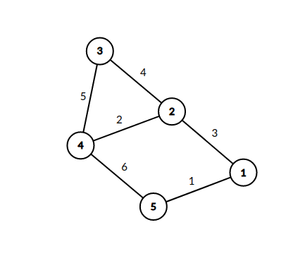
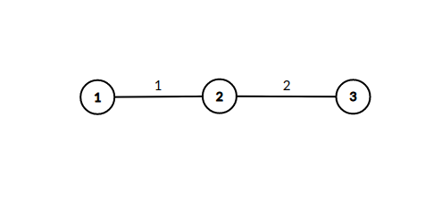

<h1 style='text-align: center;'> E. Paired Payment</h1>

<h5 style='text-align: center;'>time limit per test: 4 seconds</h5>
<h5 style='text-align: center;'>memory limit per test: 512 megabytes</h5>

There are $n$ cities and $m$ bidirectional roads in the country. The roads in the country form an undirected weighted graph. The graph is not guaranteed to be connected. Each road has it's own parameter $w$. You can travel through the roads, but the government made a new law: you can only go through two roads at a time (go from city $a$ to city $b$ and then from city $b$ to city $c$) and you will have to pay $(w_{ab} + w_{bc})^2$ money to go through those roads. Find out whether it is possible to travel from city $1$ to every other city $t$ and what's the minimum amount of money you need to get from $1$ to $t$.

## Input

First line contains two integers $n$, $m$ ($2 \leq n \leq 10^5$, $1 \leq m \leq min(\frac{n \cdot (n - 1)}{2}, 2 \cdot 10^5)$).

Next $m$ lines each contain three integers $v_i$, $u_i$, $w_i$ ($1 \leq v_i, u_i \leq n$, $1 \leq w_i \leq 50$, $u_i \neq v_i$). It's guaranteed that there are no multiple edges, i.e. for any edge $(u_i, v_i)$ there are no other edges $(u_i, v_i)$ or $(v_i, u_i)$.

## Output

For every city $t$ print one integer. If there is no correct path between $1$ and $t$ output $-1$. Otherwise print out the minimum amount of money needed to travel from $1$ to $t$.

## Examples

## Input


```

5 6
1 2 3
2 3 4
3 4 5
4 5 6
1 5 1
2 4 2

```
## Output


```

0 98 49 25 114 
```
## Input


```

3 2
1 2 1
2 3 2

```
## Output


```

0 -1 9 
```
## Note

The graph in the first example looks like this.



In the second example the path from $1$ to $3$ goes through $2$, so the resulting payment is $(1 + 2)^2 = 9$.




#### tags 

#2200 #binary_search #brute_force #constructive_algorithms #dp #flows #graphs #shortest_paths 