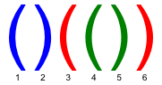
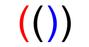
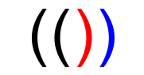
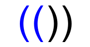
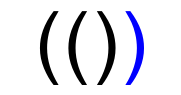

<h1 style='text-align: center;'> D. Coloring Brackets</h1>

<h5 style='text-align: center;'>time limit per test: 2 seconds</h5>
<h5 style='text-align: center;'>memory limit per test: 256 megabytes</h5>

Once Petya read a problem about a bracket sequence. He gave it much thought but didn't find a solution. Today you will face it.

You are given string *s*. It represents a correct bracket sequence. A correct bracket sequence is the sequence of opening ("(") and closing (")") brackets, such that it is possible to obtain a correct mathematical expression from it, inserting numbers and operators between the brackets. For example, such sequences as "(())()" and "()" are correct bracket sequences and such sequences as ")()" and "(()" are not.

In a correct bracket sequence each bracket corresponds to the matching bracket (an opening bracket corresponds to the matching closing bracket and vice versa). For example, in a bracket sequence shown of the figure below, the third bracket corresponds to the matching sixth one and the fifth bracket corresponds to the fourth one.

   You are allowed to color some brackets in the bracket sequence so as all three conditions are fulfilled: 

* Each bracket is either not colored any color, or is colored red, or is colored blue.
* For any pair of matching brackets exactly one of them is colored. In other words, for any bracket the following is true: either it or the matching bracket that corresponds to it is colored.
* No two neighboring colored brackets have the same color.

Find the number of different ways to color the bracket sequence. The ways should meet the above-given conditions. Two ways of coloring are considered different if they differ in the color of at least one bracket. As the result can be quite large, print it modulo 1000000007 (109 + 7).

## Input

The first line contains the single string *s* (2 ≤ |*s*| ≤ 700) which represents a correct bracket sequence. 

## Output

Print the only number — the number of ways to color the bracket sequence that meet the above given conditions modulo 1000000007 (109 + 7).

## Examples

## Input


```
(())  

```
## Output


```
12  

```
## Input


```
(()())  

```
## Output


```
40  

```
## Input


```
()  

```
## Output


```
4  

```
## Note

Let's consider the first sample test. The bracket sequence from the sample can be colored, for example, as is shown on two figures below. 

    The two ways of coloring shown below are incorrect. 

    

#### tags 

#1900 #dp 