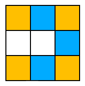
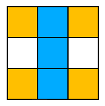
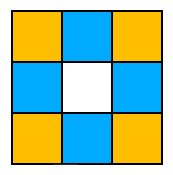
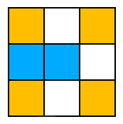

<h1 style='text-align: center;'> C. Garden of the Sun</h1>

<h5 style='text-align: center;'>time limit per test: 1 second</h5>
<h5 style='text-align: center;'>memory limit per test: 256 megabytes</h5>

There are many sunflowers in the Garden of the Sun.

Garden of the Sun is a rectangular table with $n$ rows and $m$ columns, where the cells of the table are farmlands. All of the cells grow a sunflower on it. Unfortunately, one night, the lightning stroke some (possibly zero) cells, and sunflowers on those cells were burned into ashes. In other words, those cells struck by the lightning became empty. Magically, any two empty cells have no common points (neither edges nor corners).

Now the owner wants to remove some (possibly zero) sunflowers to reach the following two goals: 

* When you are on an empty cell, you can walk to any other empty cell. In other words, those empty cells are connected.
* There is exactly one simple path between any two empty cells. In other words, there is no cycle among the empty cells.

You can walk from an empty cell to another if they share a common edge.

Could you please give the owner a solution that meets all her requirements?

## Note

 that you are not allowed to plant sunflowers. You don't need to minimize the number of sunflowers you remove. It can be shown that the answer always exists.

## Input

The input consists of multiple test cases. The first line contains a single integer $t$ ($1\le t\le 10^4$) — the number of test cases. The description of the test cases follows.

The first line contains two integers $n$, $m$ ($1 \le n,m \le 500$) — the number of rows and columns. 

Each of the next $n$ lines contains $m$ characters. Each character is either 'X' or '.', representing an empty cell and a cell that grows a sunflower, respectively.

It is guaranteed that the sum of $n \cdot m$ for all test cases does not exceed $250\,000$.

## Output

For each test case, print $n$ lines. Each should contain $m$ characters, representing one row of the table. Each character should be either 'X' or '.', representing an empty cell and a cell with a sunflower, respectively.

If there are multiple answers, you can print any. It can be shown that the answer always exists.

## Example

## Input


```

5
3 3
X.X
...
X.X
4 4
....
.X.X
....
.X.X
5 5
.X...
....X
.X...
.....
X.X.X
1 10
....X.X.X.
2 2
..
..

```
## Output


```

XXX
..X
XXX
XXXX
.X.X
.X..
.XXX
.X...
.XXXX
.X...
.X...
XXXXX
XXXXXXXXXX
..
..

```
## Note

Let's use $(x,y)$ to describe the cell on $x$-th row and $y$-th column.

In the following pictures white, yellow, and blue cells stand for the cells that grow a sunflower, the cells lightning stroke, and the cells sunflower on which are removed, respectively.



In the first test case, one possible solution is to remove sunflowers on $(1,2)$, $(2,3)$ and $(3 ,2)$. 



Another acceptable solution is to remove sunflowers on $(1,2)$, $(2,2)$ and $(3,2)$. 



This output is considered wrong because there are 2 simple paths between any pair of cells (there is a cycle). For example, there are 2 simple paths between $(1,1)$ and $(3,3)$.

1. $(1,1)\to (1,2)\to (1,3)\to (2,3)\to (3,3)$
2. $(1,1)\to (2,1)\to (3,1)\to (3,2)\to (3,3)$



This output is considered wrong because you can't walk from $(1,1)$ to $(3,3)$.


#### tags 

#2300 #constructive_algorithms #graphs 