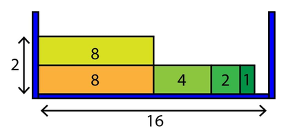

<h1 style='text-align: center;'> B. Box Fitting</h1>

<h5 style='text-align: center;'>time limit per test: 1 second</h5>
<h5 style='text-align: center;'>memory limit per test: 256 megabytes</h5>

You are given $n$ rectangles, each of height $1$. Each rectangle's width is a power of $2$ (i. e. it can be represented as $2^x$ for some non-negative integer $x$). 

You are also given a two-dimensional box of width $W$. ## Note

 that $W$ may or may not be a power of $2$. Moreover, $W$ is at least as large as the width of the largest rectangle.

You have to find the smallest height of this box, such that it is able to fit all the given rectangles. It is allowed to have some empty space left in this box after fitting all the rectangles.

You cannot rotate the given rectangles to make them fit into the box. Moreover, any two distinct rectangles must not overlap, i. e., any two distinct rectangles must have zero intersection area.

See notes for visual explanation of sample input.

## Input

The first line of input contains one integer $t$ ($1 \le t \le 5 \cdot 10^3$) — the number of test cases. Each test case consists of two lines.

For each test case:

* the first line contains two integers $n$ ($1 \le n \le 10^5$) and $W$ ($1 \le W \le 10^9$);
* the second line contains $n$ integers $w_1, w_2, \dots, w_n$ ($1 \le w_i \le 10^6$), where $w_i$ is the width of the $i$-th rectangle. Each $w_i$ is a power of $2$;
* additionally, $\max\limits_{i=1}^{n} w_i \le W$.

The sum of $n$ over all test cases does not exceed $10^5$.

## Output

## Output

 $t$ integers. The $i$-th integer should be equal to the answer to the $i$-th test case — the smallest height of the box.

## Example

## Input


```

2
5 16
1 2 8 4 8
6 10
2 8 8 2 2 8

```
## Output


```

2
3

```
## Note

For the first test case in the sample input, the following figure shows one way to fit the given five rectangles into the 2D box with minimum height:

  In the figure above, the number inside each rectangle is its width. The width of the 2D box is $16$ (indicated with arrow below). The minimum height required for the 2D box in this case is $2$ (indicated on the left).

In the second test case, you can have a minimum height of three by keeping two blocks (one each of widths eight and two) on each of the three levels.


#### tags 

#1300 #binary_search #bitmasks #data_structures #greedy 