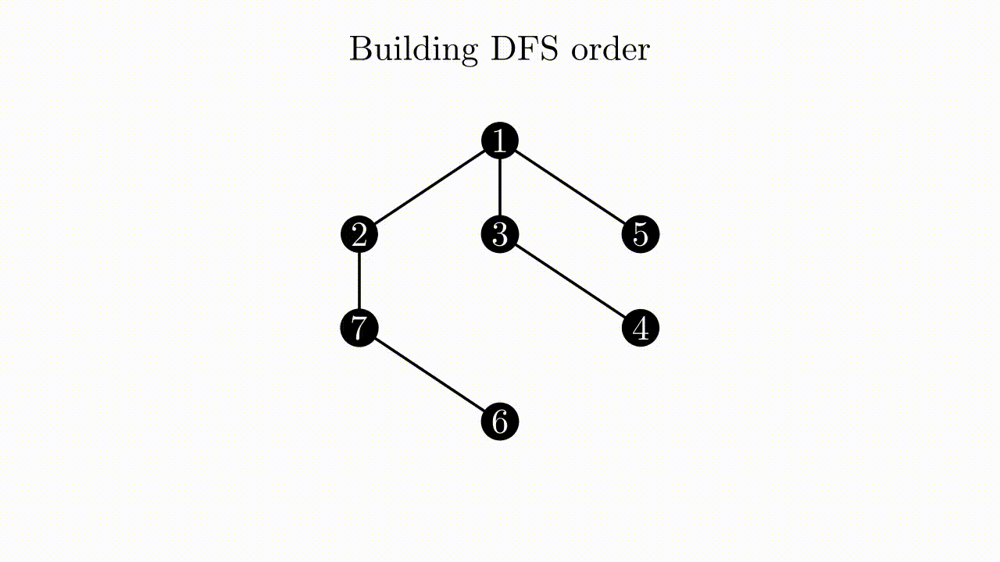

<h1 style='text-align: center;'> E. Tree Calendar</h1>

<h5 style='text-align: center;'>time limit per test: 2 seconds</h5>
<h5 style='text-align: center;'>memory limit per test: 512 megabytes</h5>

Yuu Koito and Touko Nanami are newlyweds! On the wedding day, Yuu gifted Touko a directed tree with $n$ nodes and rooted at $1$, and a labeling $a$ which is some DFS order of the tree. Every edge in this tree is directed away from the root.

After calling dfs(1) the following algorithm returns $a$ as a DFS order of a tree rooted at $1$ :


```
  
order := 0  
a := array of length n   
  
function dfs(u):  
    order := order + 1  
    a[u] := order  
    for all v such that there is a directed edge (u -> v):  
        dfs(v)  

```
## Note

 that there may be different DFS orders for a given tree.

Touko likes the present so much she decided to play with it! On each day following the wedding day, Touko performs this procedure once:

* Among all directed edges $u \rightarrow v$ such that $a_u < a_v$, select the edge $u' \rightarrow v'$ with the lexicographically smallest pair $(a_{u'}, a_{v'})$.
* Swap $a_{u'}$ and $a_{v'}$.

Days have passed since their wedding, and Touko has somehow forgotten which date the wedding was and what was the original labeling $a$! Fearing that Yuu might get angry, Touko decided to ask you to derive these two pieces of information using the current labeling.

Being her good friend, you need to find the number of days that have passed since the wedding, and the original labeling of the tree. However, there is a chance that Touko might have messed up her procedures, which result in the current labeling being impossible to obtain from some original labeling; in that case, please inform Touko as well.

## Input

The first line of the input contains an integer $n$ ($2 \le n \le 3 \cdot 10^5$) — the number of nodes on the tree.

The second line contains $n$ integers $a_1$, $a_2$, ..., $a_n$ ($1 \le a_i \le n$, all $a_i$ are distinct) — the current labeling of the tree.

Each of the next $n - 1$ lines contains two integers $u_i$ and $v_i$ ($1 \le u, v \le n$, $u \neq v$), describing an directed edge from $u_i$ to $v_i$. The edges form a directed tree rooted at $1$.

## Output

If the current labeling is impossible to arrive at from any DFS order, print NO.

Else, on the first line, print YES. On the second line, print a single integer denoting the number of days since the wedding. On the third line, print $n$ numbers space-separated denoting the original labeling of the tree. 

If there are multiple correct outputs, print any. This means: you are allowed to output any pair (DFS order, number of days), such that we get the current configuration from the DFS order you provided in exactly the number of days you provided.

## Examples

## Input


```

7
4 5 2 1 7 6 3
1 5
7 6
1 2
2 7
3 4
1 3

```
## Output


```

YES
5
1 4 2 3 7 6 5

```
## Input


```

7
7 6 5 3 1 4 2
4 3
2 5
3 7
1 4
7 2
2 6

```
## Output


```

NO

```
## Note

The following animation showcases the first sample test case. The white label inside the node represents the index of the node $i$, while the boxed orange label represents the value $a_i$.

  

#### tags 

#3100 #brute_force #constructive_algorithms #data_structures #dfs_and_similar #sortings #trees 