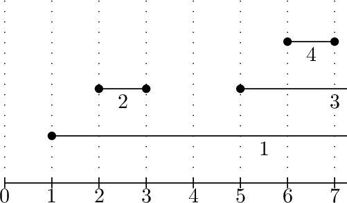
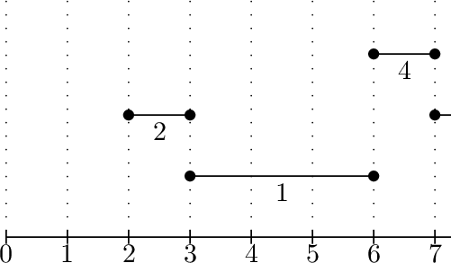

<h1 style='text-align: center;'> H. Hard Optimization</h1>

<h5 style='text-align: center;'>time limit per test: 3 seconds</h5>
<h5 style='text-align: center;'>memory limit per test: 512 megabytes</h5>

You are given a set of $n$ segments on a line $[L_i; R_i]$. All $2n$ segment endpoints are pairwise distinct integers.

The set is laminar — any two segments are either disjoint or one of them contains the other.

Choose a non-empty subsegment $[l_i, r_i]$ with integer endpoints in each segment ($L_i \le l_i < r_i \le R_i$) in such a way that no two subsegments intersect (they are allowed to have common endpoints though) and the sum of their lengths ($\sum_{i=1}^n r_i - l_i$) is maximized.

## Input

The first line contains a single integer $n$ ($1 \le n \le 2 \cdot 10^3$) — the number of segments.

The $i$-th of the next $n$ lines contains two integers $L_i$ and $R_i$ ($0 \le L_i < R_i \le 10^9$) — the endpoints of the $i$-th segment.

All the given $2n$ segment endpoints are distinct. The set of segments is laminar.

## Output

On the first line, output the maximum possible sum of subsegment lengths.

On the $i$-th of the next $n$ lines, output two integers $l_i$ and $r_i$ ($L_i \le l_i < r_i \le R_i$), denoting the chosen subsegment of the $i$-th segment.

## Example

## Input


```

4
1 10
2 3
5 9
6 7

```
## Output


```

7
3 6
2 3
7 9
6 7

```
## Note

The example input and the example output are illustrated below.  


#### tags 

#3200 #dp 